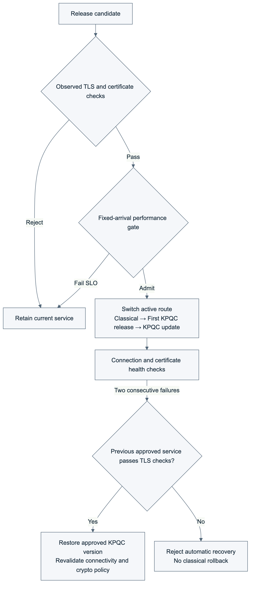

# KPQC TLS DevOps Lab

[한국어](README.md) | English

An OpenSSL-based project that measures KPQC TLS handshake performance, admits deployments using cryptographic and performance checks, and restores a previously approved service after a failure.

The project uses [`dmfive/kpqc-ossl3`](https://hub.docker.com/r/dmfive/kpqc-ossl3). Performance experiments cover SMAUG and NTRU+ KEMs (Key Encapsulation Mechanisms), with HAETAE and AIMer signatures. The migration and recovery experiment uses SMAUG1 + HAETAE2.

## Technology stack

### Cryptography and instrumentation

  

C instruments TLS calls; Python orchestrates repeated experiments, policy evaluation and evidence checks. KPQC-enabled OpenSSL handles the actual TLS connections.

### Runtime and infrastructure

   

Docker and Compose run local experiments. Linux containers on AWS EC2 host the server/client experiments.

### CI/CD and cloud access

 

GitHub Actions runs builds, tests, deployment and cleanup. AWS IAM (Identity and Access Management) roles and OIDC (OpenID Connect) provide temporary credentials; SSH (Secure Shell) controls remote execution.

### Analysis and documentation

  

Mermaid describes the architecture, Matplotlib produces result plots, and Markdown/HTML present the methods and findings.

## Quick start

Start with the local cryptographic deployment gate; no AWS account is needed. It runs a server and client within one container, establishes real TLS connections, and tests approval of compliant candidates and rejection of invalid candidates.

### 1. Prerequisites

Install Git, Python 3, Docker Engine or a running Docker Desktop, and Docker Compose. On Windows, use a WSL2 Linux shell. Run all commands from the repository root.

```sh
git clone https://github.com/17seetwice/kpqc-tls-devops-lab.git
cd kpqc-tls-devops-lab

python3 --version
docker compose version
docker info
```

The local test requires no `.env`, AWS credentials or SSH key. Compose selects a Linux amd64 image. ARM hosts such as Apple Silicon require amd64 emulation; do not directly compare their timings with AWS measurements.

### 2. Check policies and build the image

```sh
# Check policy decisions and cleanup logic without Docker
python3 scripts/test_gate_policy.py
python3 scripts/test_release_policy.py
python3 scripts/test_ci_deploy.py

# Download the KPQC base image and build the TLS test program
docker compose -f compose.gate.yaml build
```

Each Python test command should finish with `OK`. The first build requires internet access and time to download the image and install packages. The base image is pinned by its SHA-256 content digest.

### 3. Run the local TLS deployment gate

```sh
mkdir -p artifacts
docker compose -f compose.gate.yaml run --rm gate
```

The test generates certificates, prepares the active service, rejects classical/mixed candidates, approves and routes to compliant KPQC candidates, then saves results and cleans up. Rejection messages for invalid candidates are expected. The test container is removed on exit; result files remain.

### 4. Inspect results

Results are written to `artifacts/local-gate-TIMESTAMP/results.json`. Summarize the most recent run with:

```sh
python3 - <<'PYCODE'
import json
from pathlib import Path
runs = sorted(Path("artifacts").glob("local-gate-*/results.json"))
if not runs:
    raise SystemExit("No results.json found; check the experiment output.")
path = runs[-1]
result = json.loads(path.read_text())
checks = result["assertions"]
print("file:", path)
print("status:", result["status"])
print("checks:", sum(check["passed"] for check in checks), "/", len(checks))
print("cleanup_errors:", result.get("cleanup_errors", []))
PYCODE
```

The current expected outcome is `status: passed`, `checks: 63 / 63`, and `cleanup_errors: []`.

### 5. Run a short handshake measurement

After the gate test, run a short measurement over three representative configurations. It uses the same image and exercises fresh/reused-process conditions.

```sh
docker compose -f compose.gate.yaml run --rm --entrypoint python3 gate /app/scripts/extended_handshake.py --local --balanced --smoke
```

Results are written to `artifacts/local-extended-TIMESTAMP/results.json`. Remove `--smoke` to run all 43 configurations across ten blocks. This command measures timing and does not include the separate memory experiment. Local tests use loopback and do not reproduce networking between two EC2 instances.

### 6. Extend to AWS

Follow the [setup guide](docs/aws-setup.en.md) to prepare two lab EC2 instances and GitHub Actions Secrets. Open Actions → `AWS PQC deployment gates` → `Run workflow` and select the required experiment.

- `balanced_latency`: balanced-order measurements across 43 configurations.
- `systems_experiments`: MTU, network delay, HRR, concurrent load and deployment under load.
- `release_lifecycle`: classical-to-KPQC migration, performance admission and recovery.

For a fork, update the repository restriction (`github.repository`) in the [workflow](.github/workflows/aws-deploy.yml) and the AWS role's trust conditions to match your repository. The local quick start requires neither change. After AWS execution, check `cleanup_complete` in the cleanup record and confirm that the EC2 instances are stopped.

## Validation objectives and experimental design

The experiments measure KPQC TLS costs and validate cryptographic/performance-based deployment admission and recovery.

### 1. Handshake cost

- Method: compare 42 KPQC combinations and a classical baseline; record latency, CPU time and message size, with separate memory runs.
- Outcome: analyze 1,290 initial timing samples, 129 memory samples and 2,580 balanced-order timing samples. [Configuration results](after_claude/balanced/README.en.md)

### 2. Network and concurrency

- Method: vary MTU, added delay, HRR and concurrency across five representative configurations.
- Outcome: HRR adds approximately 31 ms at 30 ms added round-trip delay; validate 273,091 concurrent-load connections. [Network and throughput results](after_claude/systems/README.en.md)

### 3. Cryptographic gate

- Method: require approved TLS 1.3/SMAUG1/HAETAE2 connections to succeed and classical-only or TLS 1.2 connections to fail.
- Outcome: reject candidates accepting X25519 even when KPQC succeeds; pass 63 assertions including evidence checks.

### 4. Performance admission

- Method: test each candidate at 10 arrivals/s for three 10-second windows; check failures, completion within 200 ms, p95 and generator lateness.
- Outcome: admit two normal candidates and reject the injected 350 ms delay candidate, despite 300 successful TLS connections per candidate. [Criteria and decisions](after_claude/release/README.en.md)

### 5. Deployment and recovery

- Method: test routing under load separately from server-process failure; recheck the previous approved KPQC service before recovery.
- Outcome: zero failures in 24,504 deployment-retest connections. The separate fault test recovers in 2.951 s, with 21 failures among 150 attempts.

### 6. Automation and evidence

- Method: GitHub Actions runs build → tests → AWS deployment → evidence collection → cleanup.
- Outcome: the final run passes 63 cryptographic-gate and 24 migration/admission/recovery assertions; EC2 shutdown and temporary SSH rule removal are confirmed. [Execution record](https://github.com/17seetwice/kpqc-tls-devops-lab/actions/runs/36032662708)

Results apply to their individual execution conditions and are not pooled across runs. See the [full walkthrough (Korean)](docs/lab-meeting/PROJECT_WALKTHROUGH.ko.md) or its [HTML version](docs/lab-meeting/PROJECT_WALKTHROUGH.ko.html) for the design rationale and detailed procedure.

## Environment and measurement boundaries

The server and client each run on one m7i.large EC2 instance in the same Seoul availability zone, communicating over private IPv4. Each experimental container is limited to 2 CPUs and 512 MiB memory. Concurrent client counts refer to processes within the client instance, not additional EC2 instances.

| Experiment | Network conditions | Configurations |
|---|---|---|
| Initial and balanced-order measurements | Docker host networking, interface MTU 9001 | SMAUG 1/3/5 and NTRU+ 576/768/864/1152 × HAETAE 2/3/5 and AIMer 128f/192f/256f, plus the classical baseline |
| Network and concurrent load | Docker bridge; MTU 1500/9001 comparison; consult individual reports for each trial | Classical baseline and {SMAUG1, NTRU+ KEM768} × {HAETAE2, AIMer128f} |
| Performance admission and recovery | Docker bridge, MTU 1500 | Migration from X25519 + ECDSA P-256 to SMAUG1 + HAETAE2 |

Performance comparisons include different security parameter sets and do not rank algorithms at equivalent security levels. Separately, deployment tests fix SMAUG1 + HAETAE2 as the approved combination. Deploying another KPQC combination requires updating the policy.

| Metric | Boundary and interpretation |
|---|---|
| TLS handshake latency | Monotonic elapsed time around the client's `SSL_connect`. Excludes TCP establishment, explicit initialization and the experimental readiness signal; lazy initialization inside the call may remain. |
| Server/client CPU time | Difference in user plus system CPU time around each process's SSL call. Distinct from elapsed time that includes network waiting. |
| Handshake-interval peak RSS (Resident Set Size) increase | Reset the RSS high-water mark after initialization and measure its increase during the call in a separate run. Three samples per configuration; not total memory requirements or a fixed per-connection cost. |
| Handshake message size | Sum of message-callback send/receive lengths. Excludes TLS record and TCP/IP headers and retransmissions from wire traffic accounting. |

Clients explicitly trust the self-signed server certificate and verify its hostname. Authentication is server-only, without mTLS (Mutual TLS). Experimental readiness and deployment-route selection occur outside the TLS call. This connection procedure and custom TLS identifiers assume test programs using the same image.

## TLS handshake performance

The balanced follow-up analyzed 2,580 connections: 43 configurations × 2 modes × 30 measurements. Preparation and monitoring connections were excluded from analysis.

| Execution mode | X25519 + ECDSA P-256 median | Range of KPQC configuration medians |
|---|---:|---:|
| Fresh process | 1.724 ms | 3.891–12.218 ms |
| Reused process | 0.815 ms | 2.852–11.500 ms |

Measurements span the client's `SSL_connect` call. Each range gives the smallest and largest median across 42 KPQC configurations. In fresh-process mode, the server forks a child per connection. Reused-process mode still creates a new connection and performs a full TLS handshake each time. [Methods and complete results](after_claude/balanced/README.en.md)

## Deployment lifecycle



1. Initial KPQC deployment candidate replaces X25519 + ECDSA P-256 with SMAUG1 + HAETAE2.
2. Subsequent update candidate retains the algorithms but uses a new server certificate and a separate server process. Business functionality is unchanged.
3. Recovery injects a failure into the new deployment, checks the previous service's current TLS connectivity, certificate and cryptographic policy, then restores routing to that approved service. KPQC remains in use.

Successful TLS connectivity does not imply deployment approval. Observed cryptographic settings and performance must both satisfy policy. Policy violations or missing evidence preserve the current service.

## Performance-based admission results

Two m7i.large EC2 (Elastic Compute Cloud) instances in the same Seoul availability zone; each container has 2 CPUs and 512 MiB memory, with Docker bridge networking and MTU (Maximum Transmission Unit) 1500. Each candidate receives 10 arrivals/s for three 10-second windows: 300 attempts.

The SLO (Service Level Objective) is a synthetic target fixed before testing. Every window requires ≤1% failed attempts, ≥99% successful completion within 200 ms and successful completion p95 ≤200 ms. Load-generator lateness p95 must be ≤50 ms.

| Candidate | Cryptographic checks | Completion p95 by window | Decision |
|---|---|---|---|
| Candidate with injected 350 ms delay | Pass | 382.56 / 382.46 / 381.96 ms | Reject |
| Initial KPQC deployment candidate | Pass | 32.99 / 33.19 / 33.28 ms | Admit |
| Subsequent update candidate | Pass | 33.20 / 32.56 / 32.74 ms | Admit |

Completion time spans scheduled arrival to test-client process exit, including initialization, TCP and TLS. Pure TLS (Transport Layer Security) handshake latency is recorded separately around `SSL_connect`. The 95th percentile, p95, is the value at or below which 95% of observations fall.

From the fault-injection request, detection took 1.596 s and verified recovery took 2.951 s. The 150 fault-window attempts included 21 failures; the final 20 all succeeded on the restored service. This is not a zero-downtime result.

[English report](after_claude/release/README.en.md) · [한국어 보고서](after_claude/release/README.md) · [Figure gallery](after_claude/release/gallery.html) · [Evidence audit](after_claude/release/audit.json)

## Cryptographic policy and CI/CD

Policy requires TLS 1.3, SMAUG1, HAETAE2 and TLS_AES_256_GCM_SHA384. KEM and signature identifiers are checked separately from the cipher suite. Tests cover classical KEM/signature acceptance, TLS 1.2, certificate verification results, mismatched certificate fingerprints or stale evidence and probe errors.

GitHub Actions builds and tests the image locally, obtains temporary AWS credentials through OIDC (OpenID Connect), and uses SSH (Secure Shell) to deploy the identical image to the existing server and client. It saves evidence, stops both EC2 instances and removes temporary SSH ingress. Push-triggered CI does not start EC2 instances.

[The AWS execution](https://github.com/17seetwice/kpqc-tls-devops-lab/actions/runs/36032662708) passed 63 cryptographic-gate assertions and 24 migration, admission and recovery assertions. Experiment source `c232f7d` is distinct from subsequent documentation and CI fixes. Both instances were confirmed stopped by the workflow and an independent AWS query.

## Repository structure

Selected files to understand and run the experiments.

```text
kpqc-tls-devops-lab/
├── .github/workflows/               # CI/CD workflows
│   ├── experiment.yml               # Local checks on push/PR
│   └── aws-deploy.yml               # Manual AWS experiments and cleanup
├── scripts/                         # Experiment and validation code
│   ├── tls_handshake.c              # TLS connections and instrumentation
│   ├── extended_handshake.py        # Repeated configuration measurements
│   ├── systems_experiments.py       # Network and concurrent-load trials
│   ├── gate_suite.py                # Cryptographic-gate integration tests
│   ├── gate_worker.py               # Test server/client/router control
│   ├── gate_policy.py               # Cryptographic policy decisions
│   ├── release_experiments.py       # Migration, admission and recovery
│   ├── release_policy.py            # Response-performance decisions
│   ├── ci_deploy.py                 # AWS execution, evidence and cleanup
│   └── audit_release.py             # Re-evaluate public raw records
├── policies/                        # Deployment admission criteria
│   ├── pqc-required.json            # Required crypto and forbidden probes
│   └── release-slo.json             # Performance and recovery objectives
├── after_claude/                    # Published reports, evidence and plots
│   ├── data/                        # Initial measurement and gate records
│   ├── balanced/                    # Balanced-order results
│   ├── systems/                     # Network, load and deployment results
│   └── release/                     # Admission and recovery results
├── docs/                            # Setup guides and walkthrough
│   ├── lab-meeting/                 # Full walkthrough in Markdown/HTML
│   └── assets/stack/                # Technology stack badges
├── Dockerfile.gate                  # Build the KPQC test image
└── compose.gate.yaml                # Local gate configuration
```

Local runs write generated results to `artifacts/`. Published evidence is available under `after_claude/`.

## Other experiments and reproduction

| Experiment | Documentation |
|---|---|
| Handshake, CPU and memory across 43 configurations | [Environment](after_claude/01_environment.md) · [Methods](after_claude/02_methods.md) · [Results](after_claude/03_results.md) · [English captions](after_claude/captions.en.md) |
| Balanced fresh/reused-process execution order | [English](after_claude/balanced/README.en.md) · [한국어](after_claude/balanced/README.md) |
| MTU, network delay, HelloRetryRequest, concurrency and deployment under load | [English](after_claude/systems/README.en.md) · [한국어](after_claude/systems/README.md) |
| Migration, performance admission and automatic recovery | [Plan](docs/RELEASE_EXPERIMENT_PLAN.md) · [English](after_claude/release/README.en.md) · [한국어](after_claude/release/README.md) |

Experiments have different environments and measurement boundaries; consult each report's conditions and execution records. Download the repository to open HTML reports and galleries in a browser.

Evidence entry points: [initial summary CSV](after_claude/data/summary.csv), [balanced summary CSV](after_claude/balanced/summary.csv), [cryptographic-gate records](after_claude/data/gate.public.json) and [final deployment raw records](after_claude/release/measurements.public.json). Figure galleries cover [initial measurements](after_claude/gallery.html), [balanced order](after_claude/balanced/gallery.html), [network/load](after_claude/systems/gallery.html) and [deployment/recovery](after_claude/release/gallery.html).

Re-evaluate the public deployment records without running AWS. Run from the repository root; the command writes an audit summary to the specified directory.

```sh
python3 scripts/audit_release.py after_claude/release/measurements.public.json --out /tmp/kpqc-release-audit
```

Core code: [TLS instrumentation](scripts/tls_handshake.c), [cryptographic policy](scripts/gate_policy.py), [performance policy](scripts/release_policy.py), [migration/recovery experiment](scripts/release_experiments.py), [AWS lifecycle](scripts/ci_deploy.py). [AWS setup guide](docs/aws-setup.en.md)

## Scope of the results

The injected fault stops server processes; the previous approved service remains on the same EC2 instance. The experimental TCP router changes destinations for new connections. Production load-balancer draining and instance or availability-zone failure recovery were not tested.

In the final deployment experiment, private keys reside in the server container’s temporary memory filesystem (`tmpfs`) and are removed with the container during cleanup. Only public trust certificates are supplied to the client. A separate production key-management system is not implemented.

Repeated samples come from executions on the same instance pair. Independent replication across dates and instance pairs is outside the evaluated scope. The controller collecting and evaluating evidence is a trusted component.

Results describe the project OpenSSL image under bounded laboratory load with directly trusted server certificates. Production PKI (Public Key Infrastructure) chains, long-term availability, financial transaction preservation and interoperability with other TLS implementations are outside the verified scope. EBS (Elastic Block Store) volumes remain after EC2 shutdown.
