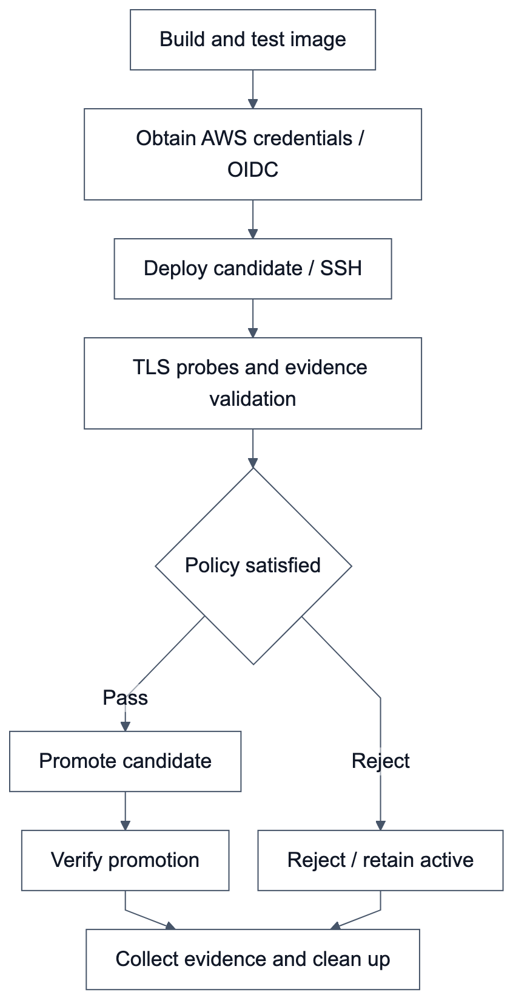

# KPQC TLS DevOps Lab

[한국어](README.md) | **English**

**A reproducible experimental project for KPQC TLS (Transport Layer Security) 1.3 handshake measurement and policy-based deployment validation.**

Two research questions guide the experiments: (1) What connection-establishment costs arise across KEM/signature configurations? (2) Can observed TLS behavior identify cryptographic configuration regressions before promotion?

The experimental OpenSSL integration uses [`dmfive/kpqc-ossl3`](https://hub.docker.com/r/dmfive/kpqc-ossl3) OpenSSL integration: SMAUG and NTRU+ KEMs, with HAETAE and AIMer signatures.

## 1. Architecture and deployment policy


*Figure 1. Observed candidate behavior and approved policy determine active-route promotion.*

The **active** service handles current traffic. A **candidate** is a new version awaiting validation. Clients probe the router's candidate route; the gate checks negotiated parameters, certificate verification, prohibited-client rejection and evidence binding. Approval switches the active route to the candidate; rejection preserves the existing service.

The active service already uses PQC (Post-Quantum Cryptography). The experiment detects cryptographic configuration regression during updates. **Successful TLS connectivity does not imply deployment approval.**

The current [policy](policies/pqc-required.json) requires TLS 1.3, SMAUG1, HAETAE2 and TLS_AES_256_GCM_SHA384. KEM (Key Encapsulation Mechanism) and signature identifiers are checked separately from the cipher suite.

| Scenario | Expected behavior |
|---|---|
| Approved PQC configuration | Approve and promote |
| Wrong KEM or signature | Reject |
| Mixed PQC/classical configuration | Reject if a classical-only probe succeeds, even when PQC works |
| TLS 1.2 | Reject; probe capability checked using a positive control |
| Candidate/certificate/image/policy mismatch or stale evidence | Reject |
| Probe timeout or malformed output | Reject |

Final local and AWS (Amazon Web Services) gate runs each passed **63/63 assertions**. Active-route monitoring observed 69 samples with zero failures. Expected rejection counts as a successful test. [Final AWS evidence](after%20claude/data/gate.public.json)

## 2. Experimental design and results

Two m7i.large EC2 (Elastic Compute Cloud) instances in the same Seoul AZ (Availability Zone) communicate over private IPv4, Docker host networking and MTU (Maximum Transmission Unit) 9001. The matrix contains 7 KEM parameter sets × 6 signatures plus one classical baseline: 43 configurations.

| Metric | X25519 + ECDSA (Elliptic Curve Digital Signature Algorithm) | Range of PQC configuration medians |
|---|---:|---:|
| Fresh-process handshake | 1.388 ms | 3.503–11.287 ms |
| Reused-process handshake | 0.538 ms | 2.403–10.529 ms |
| Client peak RSS (Resident Set Size) growth | 460 KiB | 648–980 KiB |
| Server peak RSS growth | 420 KiB | 628–1,252 KiB |

Latency covers the client SSL_connect call only: five rounds with three analyzed connections each. Reused processes still perform full handshakes without session resumption. Memory is measured separately using three fresh-process runs, reporting handshake-window peak RSS growth.


*Figure 2. Baseline and SMAUG handshake latency. Each point is the median of 15 connections per configuration and mode.*

Table ranges represent the minimum and maximum across configuration medians. [English captions](after%20claude/captions.en.md) cover all figures. Detailed [environment](after%20claude/01_environment.md), [methods](after%20claude/02_methods.md) and [results](after%20claude/03_results.md) are currently in Korean; figures are available in both languages.

## 3. CI/CD and execution provenance



*Figure 3. Manual AWS deployment workflow. Both policy outcomes lead to evidence collection and resource cleanup.*

| Workflow | Trigger | Purpose |
|---|---|---|
| [CI](.github/workflows/experiment.yml) | Push / PR | Policy and cleanup tests, Docker file experiment and gate integration tests |
| [AWS deployment gates](.github/workflows/aws-deploy.yml) | Manual on main | Build/test → OIDC (OpenID Connect) → SSH (Secure Shell) deployment → gate → evidence and cleanup |

OIDC supplies temporary AWS credentials; SSH executes EC2 commands. Pushing does not start EC2 instances.

**The latest 63-assertion gate and the performance measurements above were run on AWS by a local controller.** The earlier [GitHub Actions run](https://github.com/17seetwice/kpqc-tls-devops-lab/actions/runs/35961683618) covers the previous 32-assertion suite. A new remote CI run for this documentation revision has not yet been executed.

## 4. Reproduction and source layout

Docker, Compose and an amd64 execution environment are required. The base image is digest-pinned.

```sh
python3 scripts/test_gate_policy.py
python3 scripts/test_ci_deploy.py
docker compose -f compose.gate.yaml run --build --rm gate
```

| Source | Responsibility |
|---|---|
| [gate_policy.py](scripts/gate_policy.py) | Evaluate observed TLS behavior |
| [gate_suite.py](scripts/gate_suite.py), [gate_worker.py](scripts/gate_worker.py) | Candidate probes, rejection and promotion |
| [tls_handshake.c](scripts/tls_handshake.c) | SSL-call latency, CPU (Central Processing Unit), RSS and negotiation records |
| [extended_handshake.py](scripts/extended_handshake.py) | Randomized configuration order and repeated measurements |
| [ci_deploy.py](scripts/ci_deploy.py) | EC2 lifecycle, image identity and cleanup |
| [figures.py](after%20claude/scripts/figures.py) | Recompute summaries and render bilingual figures |

See the [AWS setup guide](docs/aws-setup.en.md). The earlier synthetic XML signing/transfer experiment runs with `docker compose run --build --rm lab`; its timing is separate from handshake latency.

## 5. Scope and future work

Measurements use one EC2 pair, sequential connections and directly trusted server leaf certificates. Custom identifiers do not demonstrate interoperability with other TLS implementations. Configurations span different security parameters. The experiments do not establish production availability, concurrent capacity or an equal-security algorithm ranking. Evidence binding assumes a trusted controller.

Current latency modes ran in cold-then-warm order. [Planned extensions](after%20claude/05_future_experiments.md) include randomized mode order, repeated executions, network conditions, concurrency and deployment under load. Planned work is not reported as completed. EC2 instances are stopped after experiments; EBS volumes remain. Private keys, AWS runtime configuration and customer data are excluded.

## Documentation and review status

- [Technical report](docs/TECHNICAL_REPORT.en.md) · [한국어 기술보고서](docs/TECHNICAL_REPORT.md)
- [Three-pass review record](docs/PUBLICATION_REVIEW.md)
- Status: **Revision incorporating author review.** This revision reanalyzes existing evidence and does not report a new experiment.
