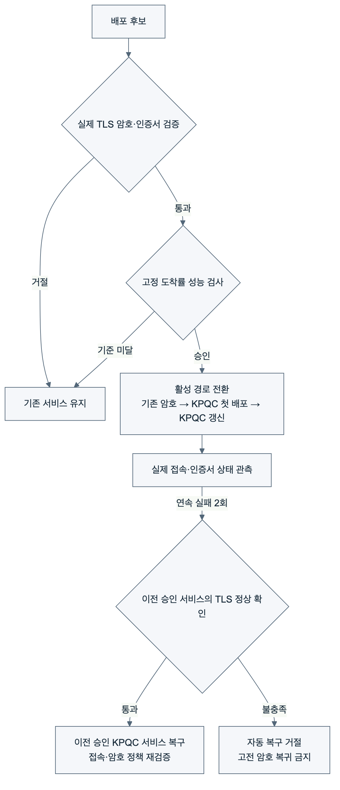

# KPQC TLS DevOps Lab

**한국어** | [English](README.en.md)

국산 양자내성암호를 통합한 OpenSSL로 **TLS 핸드셰이크 성능을 측정하고, 암호·성능 기준에 따라 배포를 승인하거나 거절하며, 장애 시 이전 승인 서비스로 복구하는 프로젝트**입니다.

[`dmfive/kpqc-ossl3`](https://hub.docker.com/r/dmfive/kpqc-ossl3) 이미지를 사용합니다. 성능 측정 대상은 SMAUG·NTRU+ KEM (Key Encapsulation Mechanism)과 HAETAE·AIMer 서명입니다. 전환·복구 실험은 SMAUG1 + HAETAE2를 사용합니다.

## 무엇을 검증했는가?

| 검증 질문 | 시험 방법 |
|---|---|
| 암호 구성과 실행 조건에 따라 핸드셰이크 비용이 어떻게 달라지는가? | 42개 KPQC 조합과 고전 기준선을 비교하고, 새 프로세스·프로세스 재사용 조건의 실행 순서를 균형화했습니다. 두 조건 모두 세션 재개 없이 전체 핸드셰이크를 수행합니다. |
| KPQC 접속만 성공하면 배포해도 되는가? | 승인된 접속의 성공과 금지된 접속의 실패를 함께 확인합니다. 예를 들어 SMAUG1과 X25519를 모두 허용한 후보는 KPQC 접속에 성공해도 거절합니다. |
| 암호 설정은 맞지만 느리거나, 배포 후 장애가 발생하면 어떻게 하는가? | 고정 도착률로 응답 성능을 검사하고, 배포 후 프로세스 중단 시 이전 승인 KPQC 서비스의 상태를 재확인해 복구합니다. |

[실험 전체 설명: 목적·환경·방법·결과](docs/lab-meeting/PROJECT_WALKTHROUGH.ko.md)에서 설계 이유와 단계별 결과를 확인할 수 있습니다. [HTML 자료](docs/lab-meeting/PROJECT_WALKTHROUGH.ko.html)는 내려받아 브라우저로 열 수 있습니다.

## TLS 핸드셰이크 성능

실행 순서를 균형화한 후속 측정은 43개 구성 × 2개 조건 × 30회로 총 2,580회를 분석했습니다. 준비·감시 연결은 분석에서 제외했습니다.

| 실행 조건 | X25519 + ECDSA P-256 중앙값 | KPQC 구성별 중앙값 범위 |
|---|---:|---:|
| 새 프로세스 | 1.724ms | 3.891–12.218ms |
| 프로세스 재사용 | 0.815ms | 2.852–11.500ms |

클라이언트의 `SSL_connect` 호출 구간을 측정한 값입니다. 범위는 42개 구성의 중앙값 중 최솟값과 최댓값입니다. 서버는 새 프로세스 조건에서 연결마다 자식 프로세스를 생성합니다. 재사용 조건에서도 연결과 TLS 핸드셰이크는 매번 새로 수행합니다. [측정 방법과 전체 결과](after_claude/balanced/README.md)

## 배포 흐름



1. **최초 KPQC 배포 후보**: 기존 X25519 + ECDSA P-256 서비스를 SMAUG1 + HAETAE2로 전환합니다.
2. **후속 업데이트 후보**: 동일 암호 조합을 유지하면서 새로운 서버 인증서와 별도 서버 프로세스로 갱신합니다. 업무 기능의 변경은 포함하지 않습니다.
3. **장애 복구**: 후속 업데이트에 장애를 주입하고, 이전 승인 서비스의 현재 TLS 연결·인증서·암호 정책을 확인한 뒤 연결 경로를 복구합니다. 복구 후에도 KPQC를 유지합니다.

**TLS 연결 성공과 배포 승인은 다릅니다.** 실제 협상 결과가 승인된 암호 설정과 일치하고 성능 기준까지 만족해야 배포합니다. 정책 위반 또는 검증 자료 누락 시 기존 서비스를 유지합니다.

## 성능 기반 배포 승인 결과

서울 동일 가용 영역의 m7i.large EC2 (Elastic Compute Cloud) 두 대, 컨테이너별 CPU 2개·메모리 512 MiB, Docker 브리지 및 MTU (Maximum Transmission Unit) 1500 조건입니다. 후보마다 초당 10회, 10초 × 3구간으로 총 300회 접속을 시도했습니다.

SLO (Service Level Objective)는 시험 전에 고정한 모의 서비스 목표입니다. 모든 구간에서 실패율 ≤1%, 200ms 이내 성공 비율 ≥99%, 성공 접속 완료 시간 p95 ≤200ms를 요구합니다. 부하 생성 지연 p95는 50ms 이하여야 합니다.

| 배포 후보 | 암호 검사 | 구간별 접속 완료 시간 p95 | 배포 결과 |
|---|---|---|---|
| 350ms 지연 주입 후보 | 통과 | 382.56 / 382.46 / 381.96ms | 거절 |
| 최초 KPQC 배포 후보 | 통과 | 32.99 / 33.19 / 33.28ms | 승인 |
| 후속 업데이트 후보 | 통과 | 33.20 / 32.56 / 32.74ms | 승인 |

접속 완료 시간은 **예정된 접속 시각부터 시험 클라이언트 종료까지**이며 초기화·TCP·TLS 등을 포함합니다. 순수 TLS (Transport Layer Security) 핸드셰이크 시간은 `SSL_connect` 호출 구간으로 별도 기록합니다. p95는 관측값의 95%가 그 값 이하인 백분위수입니다.

장애 주입 요청부터 **감지 1.596초, 복구 확인 2.951초**를 관측했습니다. 장애 관측 중 150회 접속에서 21회 실패했고, 마지막 20회는 복구된 이전 서비스로 모두 성공했습니다. 이 결과는 무중단 전환을 의미하지 않습니다.

[한글 상세 보고서](after_claude/release/README.md) · [English report](after_claude/release/README.en.md) · [그림 모음](after_claude/release/gallery.html) · [원자료 검증](after_claude/release/audit.json)

## 암호 정책과 CI/CD

암호 정책은 TLS 1.3, SMAUG1, HAETAE2, TLS_AES_256_GCM_SHA384를 요구합니다. KEM과 서명은 cipher suite와 별도로 확인합니다. 고전 KEM·서명 허용, TLS 1.2, 인증서 검증 결과, 후보와 증적의 인증서 지문 불일치, 오래된 증적 및 프로브 오류를 검사합니다.

GitHub Actions는 이미지 빌드·로컬 시험 후 OIDC (OpenID Connect)로 AWS 단기 권한을 얻고, SSH (Secure Shell)로 기존 서버·클라이언트에 동일 이미지를 배포합니다. 실행 후 증적을 저장하고 두 EC2를 중지하며 임시 SSH 규칙을 제거합니다. push CI는 EC2를 시작하지 않습니다.

[이번 AWS 실행](https://github.com/17seetwice/kpqc-tls-devops-lab/actions/runs/36032662708)에서 **기존 암호 정책 검증 63개, 전환·성능 승인·복구 검증 24개**를 통과했습니다. 실험 소스는 `c232f7d`이며 후속 문서·CI 수정과 구분합니다. EC2 두 대의 중지는 워크플로와 별도 AWS 조회로 확인했습니다.

## 다른 실험 및 재현

| 실험 | 문서 |
|---|---|
| 43개 암호 구성의 핸드셰이크·CPU·메모리 측정 | [환경](after_claude/01_environment.md) · [방법](after_claude/02_methods.md) · [결과](after_claude/03_results.md) |
| 새 프로세스·재사용 프로세스의 실행 순서 균형화 | [한국어](after_claude/balanced/README.md) · [English](after_claude/balanced/README.en.md) |
| MTU·네트워크 지연·HelloRetryRequest·동시 부하·부하 중 배포 | [한국어](after_claude/systems/README.md) · [English](after_claude/systems/README.en.md) |
| 전환·성능 승인·자동 복구 | [계획](docs/RELEASE_EXPERIMENT_PLAN.md) · [한국어](after_claude/release/README.md) · [English](after_claude/release/README.en.md) |

각 실험은 환경과 측정 구간이 다르므로 개별 보고서의 조건과 실행 기록을 따릅니다. HTML 보고서와 그림 모음은 저장소를 내려받아 브라우저로 열 수 있습니다.

Docker·Compose와 Linux amd64 실행 환경이 필요합니다. 기반 이미지는 SHA-256 digest로 고정했습니다.

```sh
python3 scripts/test_gate_policy.py
python3 scripts/test_release_policy.py
python3 scripts/test_ci_deploy.py
docker compose -f compose.gate.yaml run --build --rm gate
```

핵심 코드: [TLS 계측](scripts/tls_handshake.c), [암호 정책](scripts/gate_policy.py), [성능 정책](scripts/release_policy.py), [전환·복구 실험](scripts/release_experiments.py), [AWS 실행·정리](scripts/ci_deploy.py). [AWS 설정 가이드](docs/aws-setup.md)

복구 대상 장애는 서버 프로세스 중단이며, 이전 승인 서비스는 같은 EC2에 유지됩니다. 시험용 TCP 라우터는 새 연결의 대상을 변경하며, 운영 로드밸런서의 연결 드레이닝이나 인스턴스·가용 영역 장애 복구를 검증한 것은 아닙니다.

최종 배포 실험의 개인키는 서버 컨테이너의 임시 메모리 파일시스템(`tmpfs`)에 보관하고 종료 시 컨테이너와 함께 제거합니다. 클라이언트에는 신뢰할 공개 인증서만 전달합니다. 별도 운영 키 관리 시스템은 구현하지 않았습니다.

결과는 사용자 제작 OpenSSL 이미지, 제한된 실험 부하 및 직접 신뢰한 서버 인증서 조건의 관측입니다. 운영 PKI (Public Key Infrastructure) 체인, 장기간 가용성, 금융 거래 보존 및 다른 TLS 구현과의 상호운용은 검증 범위에 포함하지 않습니다. EC2 중지 후에도 EBS (Elastic Block Store) 볼륨은 유지됩니다.
