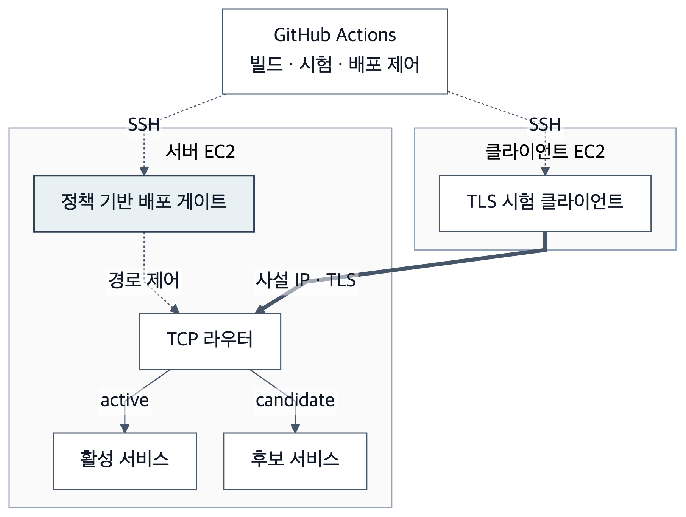
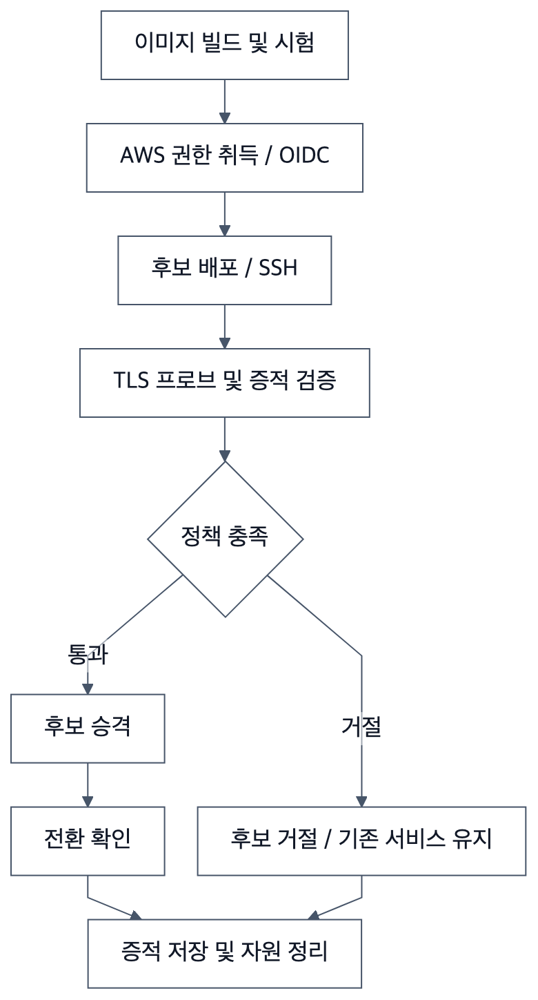

# KPQC TLS DevOps Lab

**한국어** | [English](README.en.md)

**KPQC 기반 TLS (Transport Layer Security) 1.3의 핸드셰이크 성능 및 정책 기반 배포 검증을 위한 재현 가능한 실험 프로젝트입니다.**

본 프로젝트는 두 가지 연구 질문을 다룹니다. (1) KEM (Key Encapsulation Mechanism)·서명 구성에 따른 TLS 연결 수립 비용은 얼마인가? (2) 실제 TLS 관측 결과로 배포 후보의 암호 설정 회귀를 탐지할 수 있는가?

본 프로젝트의 KPQC–OpenSSL 통합 환경인 [`dmfive/kpqc-ossl3`](https://hub.docker.com/r/dmfive/kpqc-ossl3) 이미지를 사용합니다. KEM은 SMAUG·NTRU+, 서명은 HAETAE·AIMer를 대상으로 합니다.

## 1. 시스템 구조 및 배포 정책



*그림 1. 후보의 관측 결과를 정책과 대조하여 활성 경로 전환을 결정하는 배포 게이트.*

- **Active**는 현재 트래픽을 처리하는 서비스, **candidate**는 활성화 전에 검사하는 새 버전입니다.
- 시험 클라이언트는 TCP (Transmission Control Protocol) 라우터의 후보 경로에 접속합니다. 게이트는 실제 협상·인증서 검증·금지된 접속의 거절을 정책과 비교합니다.
- 통과하면 후보로 활성 경로를 전환하고, 거절하면 기존 서비스를 유지합니다.

기존 active도 PQC를 사용합니다. 핵심은 업데이트 중 암호 설정이 이전 상태로 돌아가는 것을 탐지하는 것입니다. **TLS 접속 성공과 배포 승인은 다릅니다.**

현재 [정책](policies/pqc-required.json)은 TLS 1.3 · SMAUG1 · HAETAE2 · TLS_AES_256_GCM_SHA384를 요구합니다. KEM과 서명은 cipher suite와 별도로 확인합니다.

| 시험 | 기대 결과 |
|---|---|
| 승인된 PQC (Post-Quantum Cryptography) 구성 | 후보 승인·활성 경로 전환 |
| 잘못된 KEM 또는 서명 | 거절 |
| PQC와 고전암호를 함께 허용 | PQC 연결이 성공해도 고전 전용 접속이 성공하면 거절 |
| TLS 1.2 접속 | 거절; 별도 양성 대조로 프로브 기능 확인 |
| 후보·인증서·이미지·정책 불일치, 오래된 증적 | 거절 |
| 프로브 타임아웃·손상된 출력 | 거절 |

최종 게이트 기록에서 로컬·AWS (Amazon Web Services) 실행은 각각 **63/63개 검증 항목을 통과**했습니다. AWS 활성 경로 관측 69회에서 실패는 0회였습니다. 오류 후보의 예상된 거절도 시험 통과에 포함합니다. [최종 AWS 증적](after%20claude/data/gate.public.json)

## 2. 실험 설계 및 주요 결과

서울 동일 AZ의 m7i.large EC2 (Elastic Compute Cloud) 두 대에서 사설 IPv4·Docker host network·MTU (Maximum Transmission Unit) 9001로 측정했습니다. 7개 KEM 파라미터 × 6개 서명 파라미터와 고전 기준선, 총 43개 구성입니다.

| 조건 | X25519 + ECDSA (Elliptic Curve Digital Signature Algorithm) | PQC 구성별 중앙값 범위 |
|---|---:|---:|
| 새 프로세스 | 1.388 ms | 3.503–11.287 ms |
| 프로세스 재사용 | 0.538 ms | 2.403–10.529 ms |
| 클라이언트 최대 RSS (Resident Set Size) 증가 | 460 KiB | 648–980 KiB |
| 서버 최대 RSS 증가 | 420 KiB | 628–1,252 KiB |

시간은 클라이언트 `SSL_connect` 호출 구간만 측정합니다. 모드·구성별 5라운드 × 3회이며, 재사용 조건도 세션 재개 없는 전체 핸드셰이크입니다. 메모리는 별도 실행 3회의 호출 구간 최대 RSS 증가량입니다.


*그림 2. 기준선 및 SMAUG 구성의 핸드셰이크 지연. 각 점은 구성·모드별 15회 연결의 중앙값입니다.*

표의 범위는 PQC 구성별 중앙값의 최솟값과 최댓값입니다. 전체 조합의 그림과 측정 조건은 [결과 및 캡션](after%20claude/03_results.md), [환경·용어](after%20claude/01_environment.md), [실험 방법](after%20claude/02_methods.md)에 있습니다. [영어 그림·캡션](after%20claude/captions.en.md)

## 3. CI/CD 및 실행 이력



*그림 3. 수동 AWS 배포 워크플로. 정책 판정 이후의 성공·거절 경로는 공통 증적 수집 및 자원 정리 단계로 이어집니다.*

| 워크플로 | 실행 | 역할 |
|---|---|---|
| [CI](.github/workflows/experiment.yml) | push / PR | 정책·정리 회귀 시험, Docker 기반 파일 실험 및 게이트 통합 시험 |
| [AWS 배포 검증](.github/workflows/aws-deploy.yml) | main에서 수동 | 빌드·시험 → OIDC (OpenID Connect) → SSH (Secure Shell) 배포 → 게이트 → 증적 저장·정리 |

OIDC는 AWS 단기 권한 취득에, SSH는 EC2 명령 실행에 사용합니다. push만으로 EC2를 시작하지 않습니다.

**최신 63항목 게이트 및 위 성능 수치는 로컬 제어기로 AWS에서 실행한 결과입니다.** 기존 [GitHub Actions 실행](https://github.com/17seetwice/kpqc-tls-devops-lab/actions/runs/35961683618)은 이전 32항목 시험이며 최신 결과와 구분합니다. 현재 문서 개정안에 대한 새 원격 CI 실행은 아직 수행하지 않았습니다.

## 4. 재현 및 코드 구성

Docker Compose로 실험 환경을 실행합니다. 이미지는 Linux x86-64용이며, 동일한 기반 이미지를 사용하도록 SHA-256 식별자를 지정했습니다.

```sh
python3 scripts/test_gate_policy.py
python3 scripts/test_ci_deploy.py
docker compose -f compose.gate.yaml run --build --rm gate
```

| 파일 | 역할 |
|---|---|
| [gate_policy.py](scripts/gate_policy.py) | 관측된 TLS 결과의 정책 판정 |
| [gate_suite.py](scripts/gate_suite.py) / [gate_worker.py](scripts/gate_worker.py) | 후보·부정 프로브·전환 시험 |
| [tls_handshake.c](scripts/tls_handshake.c) | SSL 호출 시간·CPU (Central Processing Unit)·메모리·협상 계측 |
| [extended_handshake.py](scripts/extended_handshake.py) | 구성 순서 무작위화·반복 측정 |
| [ci_deploy.py](scripts/ci_deploy.py) | EC2 제어·이미지 동일성 확인·종료 정리 |
| [figures.py](after%20claude/scripts/figures.py) | 공개 원기록 재집계·한영 그림 생성 |

AWS 설정은 [가이드](docs/aws-setup.md)를 참조하세요. 기존 합성 금융 XML 서명·전송 실험은 `docker compose run --build --rm lab`으로 실행하며, 그 시간은 위 핸드셰이크 지표와 구분합니다.

## 5. 적용 범위 및 후속 연구

단일 EC2 쌍·순차 연결·직접 신뢰한 서버 리프 인증서 조건입니다. 커스텀 식별자를 사용하므로 외부 TLS 구현과의 상호운용성은 입증하지 않습니다. 서로 다른 보안 파라미터의 성능 순위나 운영 환경의 무중단·처리량을 주장하지 않습니다. 후보 증적 검증은 신뢰한 제어기를 전제로 합니다.

현재 결과는 cold 이후 warm 순서입니다. [후속 계획](after%20claude/05_future_experiments.md)은 모드 순서 무작위화와 반복 실행, 네트워크 조건, 동시 부하, 부하 중 전환입니다. 계획은 완료 결과와 구분합니다. 실험 후 EC2는 중지하며 EBS는 유지합니다. 개인키·AWS 실행 설정·고객 데이터는 공개하지 않습니다.

## 문서 및 검토 상태

- [기술보고서](docs/TECHNICAL_REPORT.md) · [Technical report](docs/TECHNICAL_REPORT.en.md)
- [3차 검토 기록](docs/PUBLICATION_REVIEW.md)
- 상태: **사용자 검토 반영본**. 기존 실행 기록의 재분석이며 신규 실험 결과를 포함하지 않습니다.

RSS·CPU·시간·메시지 바이트 및 MTU의 정의와 추가 검증 사항은 [측정 보완 문서](docs/MEASUREMENT_NOTES.md)를 참조하세요.
