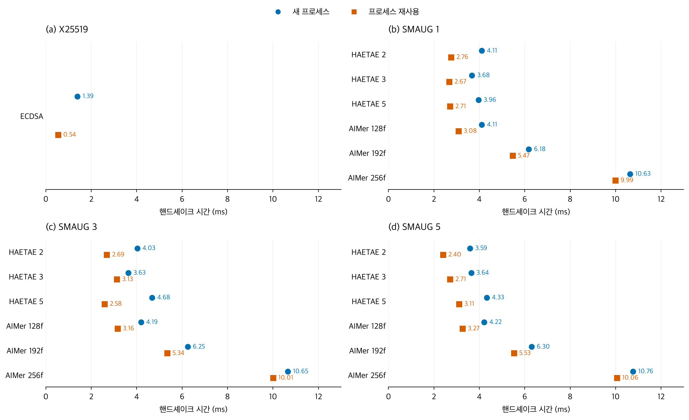
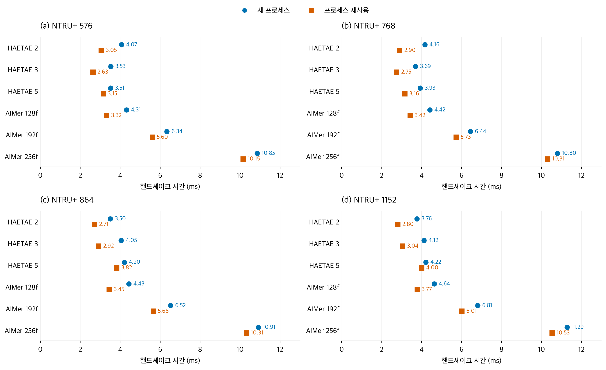
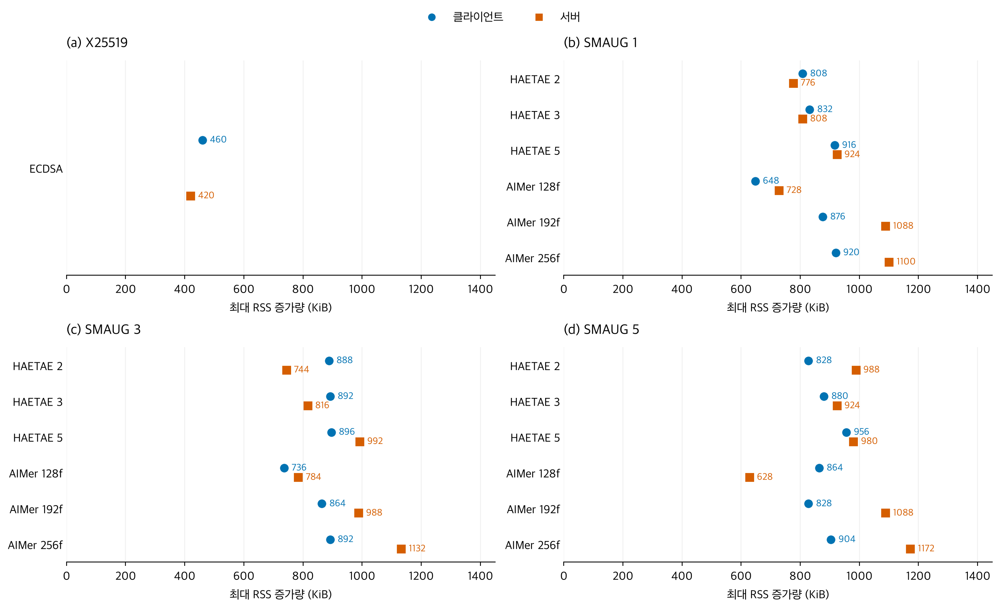
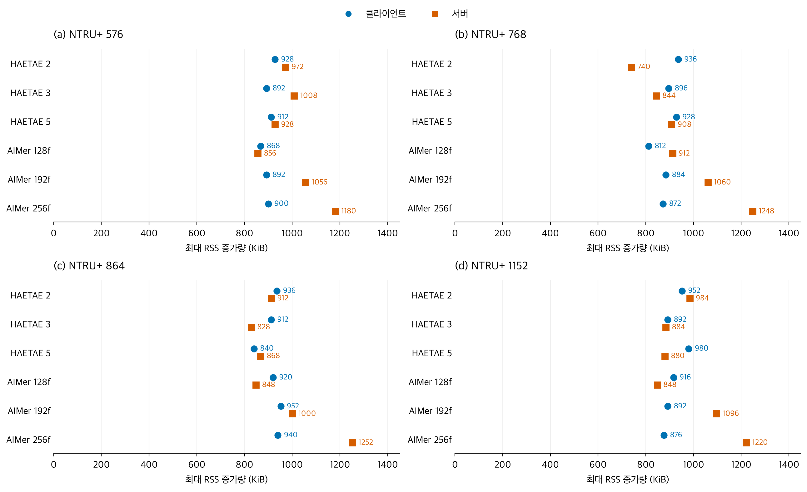
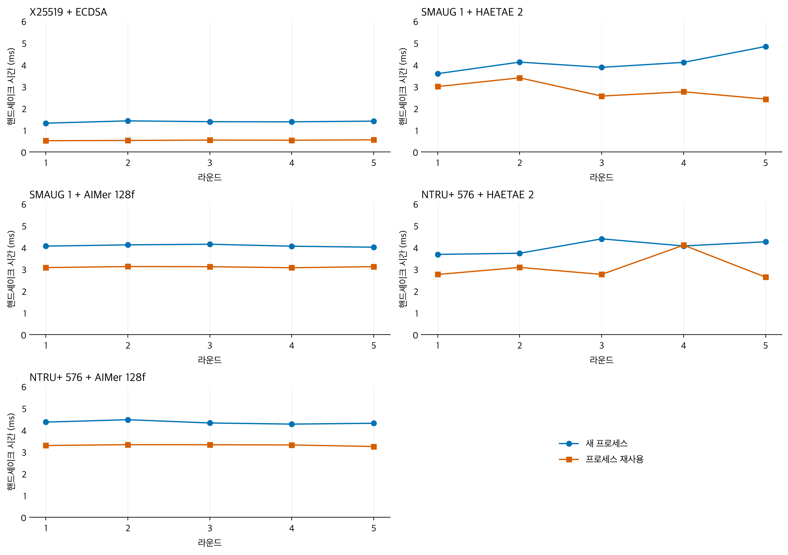

# 결과 및 그림 캡션

## 핸드셰이크 지연

새 프로세스 조건에서 기준선 중앙값은 1.388 ms, PQC (Post-Quantum Cryptography) 42개 구성의 중앙값은 3.503–11.287 ms였다. 프로세스 재사용 조건에서는 각각 0.538 ms, 2.403–10.529 ms였다. 이 환경에서 PQC 구성은 기준선보다 높은 지연을 보였다. 보안 파라미터가 서로 다르므로 이를 알고리즘 우열로 해석하지 않는다.

**그림 1. 기준선 및 SMAUG 구성의 TLS (Transport Layer Security) 핸드셰이크 지연.** 각 점은 5라운드 × 3회 연결의 클라이언트 SSL_connect 시간 중앙값이다. 원은 새 프로세스, 사각형은 프로세스 재사용 조건이다. 재사용 조건의 준비 연결은 집계에서 제외했다. 모든 연결은 세션 재개 없는 전체 핸드셰이크다.

**그림 2. NTRU+ 구성의 TLS 핸드셰이크 지연.** 측정·집계 조건과 가로축 범위는 그림 1과 동일하다. 서명 파라미터별 측정값을 각 KEM (Key Encapsulation Mechanism) 패널에 표시했다.

## 메모리

별도 메모리 실행의 구성별 중앙값은 클라이언트 648–980 KiB, 서버 628–1,252 KiB였다. 기준선은 각각 460 KiB, 420 KiB였다.

**그림 3. 기준선 및 SMAUG 구성의 핸드셰이크 구간 최대 RSS (Resident Set Size) 증가량.** 각 점은 별도 새 프로세스 실행 3회의 중앙값이다. 초기화 이후 재설정한 RSS 최고 기록을 기준으로 SSL 호출 구간의 증가를 측정했다. 원은 클라이언트, 사각형은 서버다.

**그림 4. NTRU+ 구성의 핸드셰이크 구간 최대 RSS 증가량.** 측정·집계 조건과 가로축 범위는 그림 3과 동일하다. RSS는 페이지 재사용과 파일 페이지 접근의 영향을 받으므로 암호 연산에 필요한 총 메모리와 구분한다.

## 반복 측정

**그림 5. 선택 구성의 라운드별 핸드셰이크 지연.** 각 점은 해당 라운드 3회 연결의 중앙값이다. 두 KEM 계열과 두 서명 계열의 교차 조합을 살펴보기 위해 SMAUG1/NTRU+576과 HAETAE2/AIMer128f를 선택하고 기준선을 함께 제시했다. 선택은 성능 순위에 근거하지 않으며, 전체 구성 결과는 그림 1–2에 있다. 두 모드의 같은 라운드 번호가 같은 시각의 측정을 뜻하지 않는다.

## 배포 게이트 및 자료 검증

최종 로컬·AWS (Amazon Web Services) 실행 모두 63/63개 검증 항목을 통과했다. 이는 접속 63회 성공이라는 뜻이 아니라 정상 후보 수용과 오류 후보 거절 등을 포함한 assertion 결과다. 혼합 고전/PQC 설정, 후보·증적 불일치, 오래된 증적, 프로브 타임아웃·손상 결과를 탐지했다. 승격 이후 후보 정리가 활성 서비스를 종료하지 않는지 확인했다.

AWS 전환 관측 69회에서 실패는 없었다. 이 표본은 대규모 동시 접속이나 전환 순간의 무중단 보장을 평가하지 않는다.

성능·메모리 총 수집 1,935회 중 시간 분석은 1,290회, 메모리 분석은 129회이다. 나머지는 준비 연결과 기준선 감시 측정이다. 협상 결과, 인증서 검증, 세션 재개 없음, HRR (HelloRetryRequest) 0, 양 끝의 메시지 바이트 대응 및 메모리 재설정 값을 점검했다.

주요 한계는 단일 EC2 (Elastic Compute Cloud) 쌍·동일 AZ (Availability Zone), cold 이후 warm의 고정 실행 순서, 직접 신뢰한 리프 인증서, 순차 서버, 커스텀 암호 구현이다. WAN·운영 PKI (Public Key Infrastructure)·동시 처리량은 후속 실험으로 구분한다.
