# 실험 아키텍처



**그림 6. TLS 성능 실험의 실행 구조.** 로컬 제어기가 SSH로 두 EC2의 시험 프로그램을 실행한다. 실제 TLS 트래픽은 EC2 사설 주소 사이에서 흐른다. 양 끝의 계측 결과를 수집하여 협상·시간·자원 사용을 분석한다. 성능 실험은 배포 라우터를 경유하지 않는다.



**그림 7. 관측 결과 기반 배포 게이트.** 기존 트래픽은 TCP 라우터를 통해 활성 서비스로 향한다. 라우터의 후보 경로로 검사한 결과와 승인 정책을 대조하여 활성 경로 전환 여부를 결정한다. 통과하면 후보로 경로를 전환하고, 거절하면 기존 경로를 유지한다. 실선은 통신·증적 전달, 점선은 제어 또는 전환 후 경로를 나타낸다. 클라이언트 프록시가 4433 포트의 라우터에 active/candidate 경로를 지정하며, 라우터는 TLS를 종단하지 않고 해당 서비스로 전달한다.

정책은 실제 TLS 버전·그룹·서명·인증서 검증과 금지된 접속의 거절을 기준으로 한다. Provider를 요구하지 않는다. 후보 증적에는 세대·이미지·정책·인증서 식별 정보와 시각을 연결한다.

그림은 이번 AWS 실행 구조를 표현한다. 저장소의 GitHub Actions 자동화와 이번 로컬 제어 실행을 혼동하지 않도록 OIDC를 실행 경로에 넣지 않았다. CLI 제어 코드를 CI에서 호출하는 구조로 확장할 수 있지만 실행 증적은 구분해야 한다.

Mermaid 원본과 컴파일한 SVG·PNG는 `architecture/ko`, `architecture/en`에 있다. 저장소 루트의 Mermaid CLI로 재생성할 수 있다.

```sh
.tools/mermaid/node_modules/.bin/mmdc -i 'after claude/architecture/ko/performance.mmd' -o 'after claude/architecture/ko/performance.svg' -c 'after claude/architecture/ko/mermaid-config.json' -b white
```
