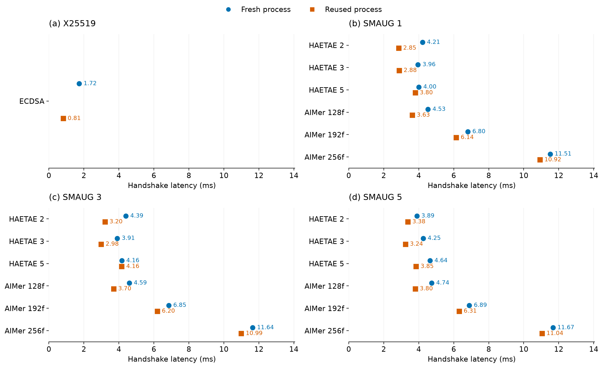

# TLS handshake latency with fresh and reused processes

[한국어](README.md) | English

Run: `aws-extended-20260924T134811Z` · Source: `cfd6bcc` · [GitHub Actions evidence](https://github.com/17seetwice/kpqc-tls-devops-lab/actions/runs/36007402798)

## What is being compared?

The experiment compares TLS handshake latency for the same cryptographic configuration when the test program starts afresh for each connection versus when a running process creates another connection.

### What does process reuse mean in this experiment?

Process reuse means using the running TLS test program and its prepared TLS configuration for another connection.

- Fresh-process mode (cold): start a new client for each connection; the server also prepares TLS configuration in a new child process.
- Reused-process mode (warm): retain the running program and its TLS configuration across connections. For one cryptographic configuration, perform two preparation connections and analyze the next three.

Both modes create a new connection and perform a full TLS handshake, including authentication and key exchange. TLS session resumption, which uses previous connection state to shorten the procedure, is disabled. The experiment compares handshake latency with and without reusing the program and configuration.

Reuse applies within repeated connections for one configuration. Fresh-process mode does not forcibly clear operating-system caches.

### Why change the measurement order?

If fresh-process trials always run first, reused-process trials are always measured later. CPU load or cache state may change during that interval, mixing execution-time effects with process-reuse effects.

A block pairs one measurement sequence for each mode. Ten blocks were run:

- Five blocks: fresh-process mode → reused-process mode.
- Five blocks: reused-process mode → fresh-process mode.
- The block order was shuffled. Within each block, the 43 configurations were randomized, with the same configuration order used for both modes.

This is balanced execution order: both modes start first equally often. Process reuse is the comparison of interest; balancing is a design choice that reduces systematic first/last ordering bias.

### What does the timer include?

Process creation, explicit TLS configuration, TCP establishment and the experimental readiness signal precede timing. The main metric is elapsed time around the client's `SSL_connect` call, not total program startup time. Initialization first performed inside the call and cache-state effects may still contribute.

## Design and validation

Two existing EC2 (Elastic Compute Cloud) instances performed sequential TLS (Transport Layer Security) connections. No additional instances were created. Ten paired blocks used five cold-first and five warm-first assignments in shuffled order. Configuration order was randomized within a block and shared across its two modes. Each of the 43 configurations has 30 analyzed connections per mode.

All 3,600 collected connections passed the protocol checks; 2,580 enter latency analysis and 1,020 are warm-up or sentinel observations. The audit checked negotiated group/signature identifiers, certificate verification, TLS version and cipher, disabled session resumption, zero HRR (HelloRetryRequest), matching directional message bytes, mode-order balance and paired configuration order. No new memory experiment was performed.

## Results

| Condition | X25519 + ECDSA | Range of PQC configuration medians |
|---|---:|---:|
| Fresh process | 1.724 ms | 3.891–12.218 ms |
| Reused process | 0.815 ms | 2.852–11.500 ms |

ECDSA denotes Elliptic Curve Digital Signature Algorithm and PQC denotes Post-Quantum Cryptography. Latency covers the client SSL_connect call.



Figure 1. Baseline and SMAUG handshake latency. Each point is the median of 30 connections per configuration and mode. Both modes perform full handshakes. Tiny differences between points rounding to the same value should not be interpreted as practical improvements.


Figure 2. NTRU+ handshake latency. Measurement conditions, aggregation and axis limits match Figure 1.

## Interpretation

Pooled within-run medians were lower for the reused-process mode in all 43 configurations, but some differences were very small. Across PQC configurations, the median of ten paired block ratios (warm/cold) ranged from approximately 0.659 to 0.988. When the blocks were split by starting mode, two configurations had a subgroup median ratio of at least one. Reuse is therefore not claimed to be faster in every block or ordering. See `paired.csv` and `blocks.csv`.

The previous run had baseline medians of 1.388 ms (cold) and 0.538 ms (warm), compared with 1.724 and 0.815 ms here. Available evidence does not identify a single cause of this between-run difference. Balanced ordering addresses the original fixed-order design but does not replace replication across dates or independent instance pairs. The two datasets were not pooled.

## Deployment and cleanup

Local and AWS gate runs each passed 63/63 assertions. The AWS active-route monitor recorded 245 samples with zero failures; this does not establish continuous availability. The workflow took 34 minutes 44 seconds, including build, instance startup, transfer, tests and cleanup. This is not TLS handshake time.

Cleanup evidence reports completion with no errors. A separate AWS API (Application Programming Interface) read confirmed that both instances were stopped. EBS (Elastic Block Store) volumes remain provisioned and have separate storage charges.

## Reproduction

```sh
.venv/bin/python 'after_claude/scripts/analyze_balanced.py' 'after_claude/balanced/measurements.public.json' 'after_claude/balanced'
```

`measurements.public.json` contains the public workflow measurements; `workflow.public.json` contains gate and cleanup evidence. `summary.csv`, `blocks.csv` and `paired.csv` hold configuration medians, block medians and paired-mode ratios. `audit.json` records the validation summary.
