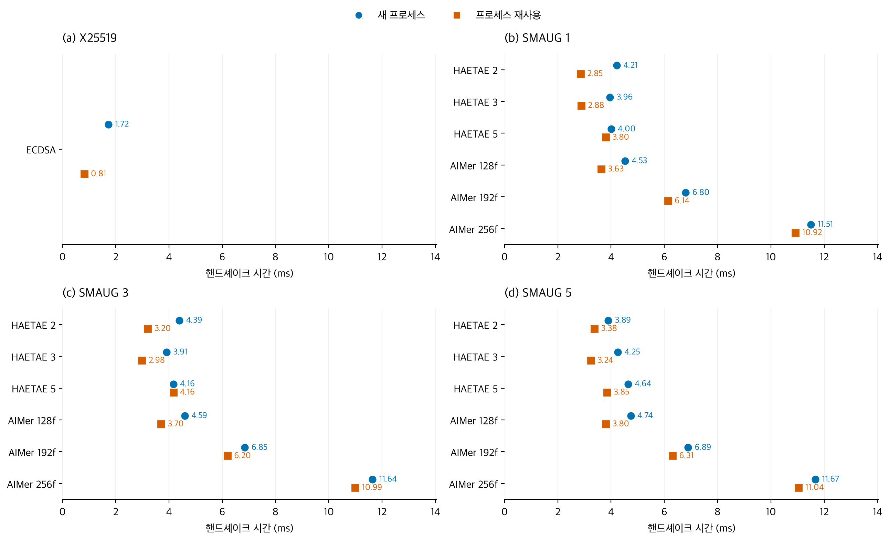
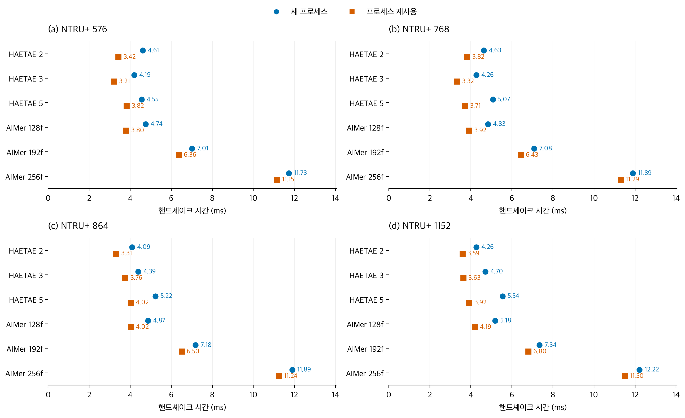

# 프로세스 재사용 여부에 따른 TLS 핸드셰이크 지연 비교

한국어 | [English](README.en.md)

실행: `aws-extended-20260924T134811Z` · 소스: `cfd6bcc` · [GitHub Actions 증적](https://github.com/17seetwice/kpqc-tls-devops-lab/actions/runs/36007402798)

## 무엇을 비교한 실험인가?

같은 암호 조합이라도 연결할 때마다 시험 프로그램을 새로 실행하는 경우와, 이미 실행 중인 프로그램에서 새 연결을 만드는 경우의 TLS 핸드셰이크 시간이 다른지 비교했다.

### 이 실험에서 프로세스 재사용이란?

프로세스 재사용은 실행 중인 TLS 시험 프로그램과 준비된 TLS 설정을 다음 연결에도 사용하는 것이다.

- 새 프로세스 조건(cold): 연결마다 클라이언트를 새로 실행하고, 서버도 새 자식 프로세스에서 TLS 설정을 준비한다.
- 재사용 조건(warm): 같은 프로그램의 실행 상태와 TLS 설정을 유지하면서 연결을 반복한다. 한 암호 구성에서 준비 연결 2회 후 3회를 분석한다.

두 조건 모두 연결은 매번 새로 만들고, 인증과 키 교환을 포함한 전체 TLS 핸드셰이크를 수행한다. 이전 연결의 상태로 절차를 줄이는 TLS 세션 재개는 사용하지 않는다. 이 실험은 프로그램과 설정의 재사용 여부에 따라 핸드셰이크 지연이 달라지는지 비교한다.

재사용은 한 암호 구성의 반복 연결에 적용한다. 새 프로세스 조건에서도 운영체제 캐시를 강제로 비우지는 않는다.

### 측정 순서를 바꾼 이유

새 프로세스 조건을 항상 먼저 측정하면, 재사용 조건은 항상 시간이 지난 뒤 측정된다. 그 사이 CPU 부하나 캐시 상태가 달라질 수 있어, 관측한 차이에 프로세스 재사용뿐 아니라 실행 시점의 영향도 섞일 수 있다.

이를 줄이기 위해 두 조건을 한 번씩 측정하는 묶음을 ‘블록’으로 정하고 총 10개를 실행했다.

- 5개 블록: 새 프로세스 조건 → 프로세스 재사용 조건.
- 나머지 5개 블록: 프로세스 재사용 조건 → 새 프로세스 조건.
- 이 10개 블록의 순서도 섞었다. 블록 안에서는 43개 암호 구성의 순서를 무작위로 정하되, 두 조건에 같은 구성 순서를 적용했다.

이처럼 어느 조건이 먼저 실행되는지 횟수를 맞춘 절차를 ‘실행 순서 균형화’라고 부른다. 비교하려는 대상은 프로세스 재사용 여부이고, 순서 균형화는 특정 조건이 늘 먼저 또는 나중에 측정되는 편향을 줄이기 위한 방법이다.

### 시간은 어디부터 어디까지 재는가?

프로세스 생성·명시적인 TLS 설정 준비·TCP 연결·시험용 준비 신호는 측정 전에 끝낸다. 대표 지표는 클라이언트 `SSL_connect` 호출 직전부터 반환 직후까지의 경과 시간이다. 따라서 프로그램 시작 전체 비용을 비교한 결과는 아니다. 다만 호출 안에서 처음 수행되는 초기화나 캐시 상태의 영향은 측정 시간에 포함될 수 있다.

## 방법 및 검증

기존 EC2 (Elastic Compute Cloud) 두 대에서 TLS (Transport Layer Security) 연결을 순차 측정하였다. 새 인스턴스를 생성하지 않았다. 10개 블록에서 cold-first와 warm-first를 각각 5개로 배정하고 순서를 섞었다. 블록 내 구성 순서는 무작위화하고 두 모드 사이에 같은 순서를 사용했다. 전체 43개 구성·모드별 분석 표본은 30개다.

총 3,600회 수집, 2,580회 분석, 준비·감시 연결 1,020회다. 원기록의 실제 그룹·서명 식별자, 인증서 검증, TLS 버전·cipher, 세션 재개 없음, HRR (HelloRetryRequest) 0, 방향별 메시지 바이트 대응을 확인했다. 5:5 시작 순서와 짝지은 구성 순서도 검증했다. 이번 실행에서는 메모리를 측정하지 않았다.

## 결과

| 조건 | X25519 + ECDSA | PQC 구성별 중앙값 범위 |
|---|---:|---:|
| 새 프로세스 | 1.724 ms | 3.891–12.218 ms |
| 프로세스 재사용 | 0.815 ms | 2.852–11.500 ms |

ECDSA는 Elliptic Curve Digital Signature Algorithm, PQC는 Post-Quantum Cryptography를 의미한다. 시간은 클라이언트 SSL_connect 호출 구간의 경과 시간이다.



그림 1. 기준선 및 SMAUG 구성의 핸드셰이크 지연. 점은 구성·모드별 30회 중앙값이다. 두 조건 모두 전체 핸드셰이크를 수행한다. 같은 값으로 반올림되는 두 점의 미세한 차이는 실용적인 성능 차이로 해석하지 않는다.



그림 2. NTRU+ 구성의 핸드셰이크 지연. 측정·집계 및 축 범위는 그림 1과 동일하다. [English SMAUG](en/latency_smaug.png) · [English NTRU+](en/latency_ntru.png)

## 해석

전체 표본 중앙값은 43개 구성 모두 재사용 조건에서 낮았으나, 일부 구성의 차이는 매우 작다. 블록별 warm/cold 중앙값 비율의 중앙값은 PQC 구성에서 약 0.659–0.988이다. 시작 순서로 나눈 5개 블록의 부분집합에서는 2개 구성에 비율 1 이상인 경우가 있다. 따라서 모든 반복·순서에서 재사용이 항상 더 빠르다고 주장하지 않는다. 구성별 값은 `paired.csv`, 블록별 값은 `blocks.csv`에 있다.

이전 실행의 기준선은 cold 1.388 ms / warm 0.538 ms였으며 이번에는 1.724 / 0.815 ms다. 두 실행의 절대값 차이를 특정 원인으로 귀속할 자료는 부족하다. 이번 설계는 모드의 고정 순서 문제를 보완하지만 단일 인스턴스 쌍의 한 실행이므로 독립 환경·여러 날짜의 재현성 검증을 대신하지 않는다. 기존 원자료와 합산하지 않았다.

## 배포 및 정리

동일 워크플로의 로컬·AWS 게이트는 각각 63/63개 항목을 통과했다. AWS 활성 경로 표본은 245회·실패 0회였다. 이 표본은 연속 가용성 보장이 아니다. 워크플로는 34분 44초에 완료됐으며 이는 빌드·EC2 시작·전달·시험·정리 전체 시간이다. TLS 시간으로 해석하지 않는다.

자동 정리 기록은 `cleanup_complete=true`, 오류 없음이다. 별도의 AWS API (Application Programming Interface) 조회에서 서버·클라이언트 모두 stopped를 확인했다. EBS (Elastic Block Store) 볼륨은 유지되므로 저장 비용은 별도다.

## 재현

```sh
.venv/bin/python 'after_claude/scripts/analyze_balanced.py' 'after_claude/balanced/measurements.public.json' 'after_claude/balanced'
```

`measurements.public.json`은 워크플로가 제공한 공개 원기록, `workflow.public.json`은 게이트와 정리 증적이다. `summary.csv`는 구성별 중앙값, `blocks.csv`는 블록 중앙값, `paired.csv`는 짝지은 모드 비율, `audit.json`은 검증 요약이다.
