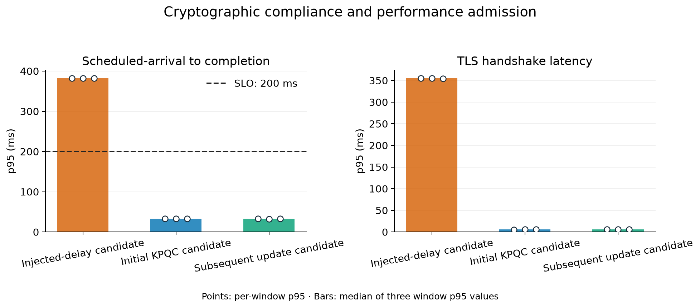

# KPQC migration, performance admission and recovery

[한국어](README.html) · [Gallery](gallery.html) · [Raw evidence](measurements.public.json) · [Audit](audit.json)

The existing TLS measurement and cryptographic gate now form one lifecycle: **classical-to-KPQC migration, performance admission, and automatic recovery to an approved KPQC version**. [GitHub Actions execution](https://github.com/17seetwice/kpqc-tls-devops-lab/actions/runs/36032662708), source `c232f7d`; 24 assertions passed. The workflow confirmed that both existing EC2 instances stopped and temporary SSH ingress was removed.

## Environment and preregistered target

Two m7i.large instances in the same Seoul availability zone; each container has 2 CPUs/512 MiB, a Docker bridge and MTU (Maximum Transmission Unit) 1500. The original service uses X25519 + ECDSA P-256; candidates use SMAUG1 + HAETAE2. The initial KPQC release and subsequent update use the same algorithms, with distinct certificates and server processes. Full TLS (Transport Layer Security) 1.3 handshakes, directly trusted server certificates and migration-capable clients are assumed.

The SLO (Service Level Objective) is a **synthetic service target**, fixed before testing. Each candidate receives 10 scheduled arrivals/s for three 10-second windows. Every window must have ≤1% failed attempts, ≥99% successful completions within 200 ms, and successful completion p95 ≤200 ms. Generator-lateness p95 >50 ms or incomplete evidence prevents admission.

Completion latency runs from scheduled arrival to C-client process exit, including scheduling, initialization, TCP, readiness, TLS and teardown. Separately recorded TLS latency covers only `SSL_connect`. There is no HTTP or business transaction. Every scheduled attempt remains in the denominator.

## Deployment roles and experiment sequence

The **initial KPQC deployment candidate** replaces the existing X25519 + ECDSA P-256 service with SMAUG1 + HAETAE2. It replaces the active service only after passing cryptographic, certificate and performance checks.

The **subsequent update candidate** models a service update after KPQC adoption. It retains SMAUG1 + HAETAE2 and uses a new server certificate and a separate server process. This experiment changes the certificate and deployment target; it does not change the cryptographic algorithms or business functionality.

After approving and deploying the update, the experiment injects a failure into the newly deployed service. The service accepted during initial KPQC deployment is now the **previously approved service**. Its current TLS connectivity, certificate and cryptographic policy are checked before routing connections back to it. The two stages test **initial KPQC adoption** and **subsequent update and recovery**, respectively, while retaining KPQC after recovery.

## Candidate admission

All candidates passed cryptographic checks. The faulted candidate intentionally waits 350 ms before server TLS processing. This validates regression detection and is not intrinsic KPQC cost. Each value below is successful completion p95(ms) from one 100-arrival window.

| Candidate | Crypto check | Final decision | Three window p95 values(ms) |
|---|---|---|---|
| Injected-delay candidate | Pass | Reject | 382.56, 382.46, 381.96 |
| Initial KPQC candidate | Pass | Admit | 32.99, 33.19, 33.28 |
| Subsequent update candidate | Pass | Admit | 33.20, 32.56, 32.74 |

The slow candidate could not be promoted; the classical service remained active. The approved initial KPQC release then replaced it, verified through the actual certificate and negotiated codes. The subsequent update was also admitted. Performance evidence is bound to the candidate generation, certificate and policy and re-evaluated at promotion.

## Failure and automatic recovery

After terminating the newly deployed server process group, two consecutive failed health observations trigger validation and restoration of the previously approved deployment. Classical targets, incorrect certificates and stale health evidence are rejected.

- Injection request to detection: **1.596s**.
- Injection request to first verified recovery: **2.951s**, against a 10-second target.
- 150 scheduled fault-window attempts: **21 failures**, 23 successful connections to the new deployment, 106 successful connections to the restored previous deployment.
- The final 20 attempts succeeded on the restored previous deployment; cryptographic policy and prohibited-client rejection were checked again.

Recovery uses one controller monotonic clock and includes SSH control round trips. Failed attempts are retained. This is not a zero-downtime or transaction-preservation claim.

## Implementation and scope

Idle accept-timeout exits in the prefork server were fixed; all eight workers and a successful connection were checked after 17 seconds idle. The former approved service stayed available while the next candidate was measured.

An earlier full Mac amd64-emulation trial rejected a healthy candidate because 2/100 attempts exceeded 200 ms. That failed trial is preserved; the target was not relaxed. Native Linux preflight and AWS execution are separate. These figures describe only the AWS execution.

This bounded trial validates admission and recovery, not maximum capacity, banking-service SLOs, long-term availability or automatic source-code migration. Initial classical-to-KPQC migration and subsequent recovery to the previously approved KPQC deployment are distinct. No classical rollback is allowed after migration.

[Workflow evidence](workflow.public.json) · [Cleanup verification](cleanup-verification.json) · [Plan](../../docs/RELEASE_EXPERIMENT_PLAN.md)
