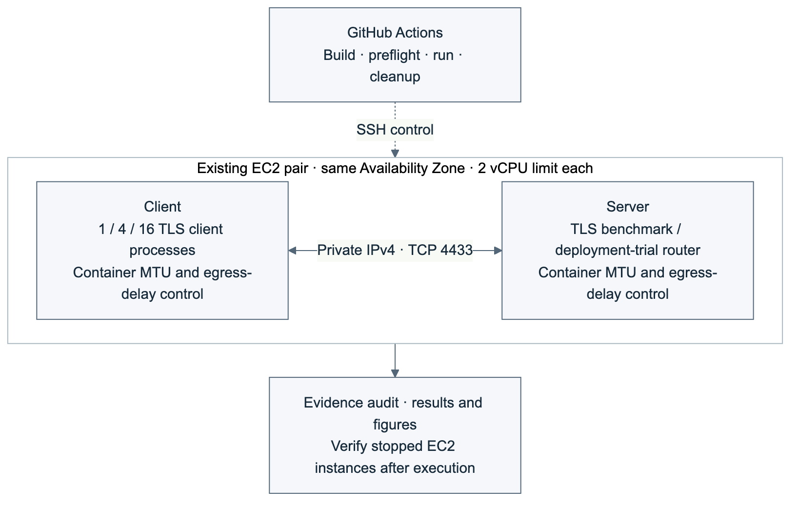

# Methods: network sensitivity and concurrent deployment

## Questions and environment

The experiment evaluates (1) MTU and delay sensitivity, (2) the incremental cost of one HRR, (3) concurrent handshake throughput, and (4) policy-gated deployment while connections continue.

Two existing m7i.large EC2 instances communicate over private IPv4 within one Availability Zone in Seoul. Each experiment container has a two-CPU quota and a 512 MiB memory limit. No new EC2 instance is created. The tested profiles are X25519 + ECDSA P-256 and {SMAUG1, NTRU+ KEM768} × {HAETAE2, AIMer128f}. These represent four KPQC families, rather than all parameter sets or a security-level-equivalent ranking.

Performance measurements connect directly to the benchmark TLS service. The separate deployment trial uses a TCP router to select active and candidate services. SSH (Secure Shell) carries experiment control, not the measured TLS traffic.

## Controlled network and full handshakes

MTU (Maximum Transmission Unit) is set to 1500 or 9001 on container interfaces; both conditions use the same Docker bridge topology. Host interfaces and SSH access remain unchanged. All EC2 instance types support MTU1500, and Internet-gateway traffic has a 1500-byte limit, making this a useful sensitivity comparison with the previous jumbo-frame environment. [AWS documentation](https://docs.aws.amazon.com/AWSEC2/latest/UserGuide/network_mtu.html)

Netem adds 0, 5 or 15 ms of egress delay at each endpoint, corresponding nominally to 0, 10 or 30 ms added RTT (Round-Trip Time). TCP_INFO records the observed MSS (Maximum Segment Size), path MTU and smoothed RTT. TCP segmentation, generic segmentation and generic receive offload must be disabled. Receiver-ingress placement is recommended for realistic TCP network emulation; this experiment instead reports controlled endpoint-egress sensitivity and does not infer WAN throughput. Concurrent throughput is measured without injected delay. [Netem documentation](https://man7.org/linux/man-pages/man8/tc-netem.8.html)

Client latency brackets one SSL_connect call using a monotonic clock. TCP setup, the benchmark readiness byte, JSON output and TLS shutdown are outside this interval. Each condition uses five full handshakes in one process with a reused SSL_CTX; the first two are retained as warmup and excluded from latency summaries. Three within-run blocks randomize the condition order. Session caching and tickets are disabled.

For HRR (HelloRetryRequest) induction, the client lists X25519 first and also supports the target KPQC group; the server permits only the target group. The trace must show exactly one HRR, versus zero in the matching-key-share control, with the same final group and CertificateVerify signature. MTU is 1500 and all three delay settings are tested.

Every connection is checked for successful certificate verification, TLS1.3, expected negotiation codes, no resumption and the intended HRR count. Directional handshake-message byte counts must agree across endpoints. These counts exclude TLS record, TCP/IP and Ethernet overhead.

## Concurrent service and deployment

Eight prefork server processes share a listening socket and each reuse an independent SSL_CTX. Sixteen priming connections precede each load window. The worker count is checked before and after the window.

One, four or sixteen client processes generate closed-loop full handshakes for eight seconds per condition, repeated in three shuffled blocks. Clients initialize their SSL_CTX before a common start signal; the first handshake in each process is included. Throughput divides completed handshakes by the actual load-window duration and therefore reflects TCP setup, termination and instrumentation overhead. It measures the instrumented service-generator pair, not cryptographic operation speed or absolute server capacity.

In addition to SSL_connect latency, the collector records TCP-connect start through SSL_connect return, including readiness waiting. The latter makes queueing visible when all server workers are busy. Each window's p95 is computed from its observed connection distribution.

The deployment trial keeps four clients connecting to the active route. A mixed-KEM candidate must be rejected because a classical-only probe succeeds. A subsequent compliant candidate may be promoted only after the existing gate validates positive/negative probes and candidate binding. Peer-certificate SHA-256 fingerprints distinguish the old and new services. Any rejected-candidate identity on the active route or failed load handshake causes validation failure.

This is one bounded transition trial. It does not establish a production availability SLA or application-data continuity on established connections.

## Analysis and reproducibility

Network and HRR figures show block medians and the median of those three values. Throughput figures similarly show three observed load-window values and their median. These are repeated blocks on one instance pair, not independent instance replications.

Record the source commit, exact delivered image identity, workflow ID, raw-record hash and cleanup outcome. Report this bridge-network experiment separately from prior host-network measurements. Certificate chains and memory are outside this follow-up run.
