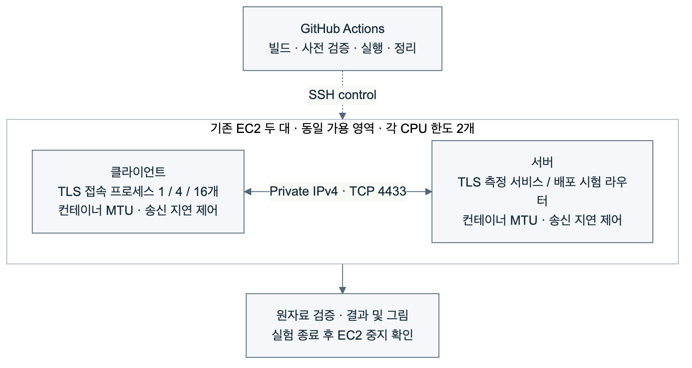

# 네트워크 및 동시 부하 실험 방법

## 연구 질문

1. 동일한 TLS 암호 조합에서 MTU와 네트워크 지연 조건을 바꾸면 핸드셰이크 지연이 어떻게 달라지는가?
2. HRR 1회가 발생할 때 같은 최종 암호 조합의 핸드셰이크 비용은 얼마나 증가하는가?
3. 병렬 처리 서버에서 동시 클라이언트 수에 따라 완료 연결 수와 접속 지연이 어떻게 달라지는가?
4. 접속 부하가 지속되는 동안 정책에 맞지 않는 후보를 거절하고 정상 후보로 전환할 수 있는가?

## 실행 환경과 대상

서울 리전의 기존 서버·클라이언트 EC2 두 대를 사용한다. 두 인스턴스는 같은 가용 영역에 있으며 사설 IPv4로 통신한다. 각 실험 컨테이너의 CPU 한도는 2개, 메모리 한도는 512 MiB다. 새로운 EC2를 생성하지 않는다.

기준선은 X25519 + ECDSA P-256이다. KPQC는 {SMAUG1, NTRU+ KEM768} × {HAETAE2, AIMer128f}의 네 조합을 사용한다. 네 알고리즘 계열을 대표하는 구성으로 선택했으며, 모든 보안 수준과 파라미터를 비교하는 실험은 아니다. 프로토콜은 TLS (Transport Layer Security) 1.3이며, 세션 재개 없이 매번 전체 핸드셰이크를 수행한다.

성능 시험은 TLS 측정 서비스로 직접 연결한다. 부하 중 배포 시험은 별도의 단계에서 TCP 라우터를 사용해 활성·후보 경로를 구분한다. SSH (Secure Shell)는 실행 제어 경로이며 TLS 측정 트래픽 경로와 구분된다.

## 네트워크 조건

MTU (Maximum Transmission Unit)는 네트워크 계층에서 전달하는 패킷의 최대 크기다. EC2는 MTU1500을 지원하며 인터넷 게이트웨이 트래픽에는 1500바이트 제한이 있다. 따라서 기존 동일 가용 영역의 MTU9001 결과에 MTU1500 대조 조건을 추가하는 것은 타당하다. [AWS 공식 문서](https://docs.aws.amazon.com/AWSEC2/latest/UserGuide/network_mtu.html)

두 조건 모두 같은 Docker 브리지 구성을 사용한다. 컨테이너 인터페이스만 1500 또는 9001로 설정하고 호스트 인터페이스와 SSH 경로는 변경하지 않는다. 양 끝 컨테이너의 송신에 각각 0, 5, 15 ms 지연을 넣는다. 설정상 추가 왕복 지연은 각각 0, 10, 30 ms다. 실제 연결에서 MSS (Maximum Segment Size), TCP_INFO가 보고한 경로 MTU, TCP가 추정한 RTT (Round-Trip Time)를 함께 기록한다. 세 가지 패킷 분할·병합 오프로딩 기능을 비활성화했는지도 확인한다.

송신 측 지연 주입은 통제된 조건 변화다. netem 문서는 현실적인 TCP 성능 재현을 위해 수신 측 적용을 권고한다. 이번 결과는 송신 지연 설정에 대한 민감도이며, 실제 광역망 처리량으로 일반화하지 않는다. 동시 접속 처리량은 추가 지연 0 ms에서 측정한다. [netem 문서](https://man7.org/linux/man-pages/man8/tc-netem.8.html)

## 핸드셰이크 및 HRR

클라이언트의 SSL_connect 호출 직전·직후 단조 시계 차이를 핸드셰이크 지연으로 기록한다. TCP 연결, 준비 신호, 결과 파일 쓰기, TLS 종료는 이 지표에 포함하지 않는다. 각 조건에서 같은 프로세스·SSL_CTX로 5회 연결하고, 처음 2회는 준비 연결로 보존하되 지연 요약에서 제외한다. 세 블록에서 조건 순서를 섞어 실행한다.

HRR (HelloRetryRequest)은 서버가 다른 키 공유를 요청할 때 사용하는 TLS 메시지다. [TLS 1.3 표준](https://www.rfc-editor.org/rfc/rfc8446.html#section-4.1.4) 유발 조건에서는 클라이언트가 X25519를 먼저 제안하되 해당 KPQC 그룹도 지원하고, 서버는 해당 KPQC 그룹만 허용한다. 메시지 기록에서 HRR 1회를 확인하며, 대조 조건은 0회여야 한다. 두 조건의 최종 KEM 그룹과 인증 서명은 같아야 한다.

인증서 검증, TLS 버전, KEM 그룹, CertificateVerify 서명 코드, 세션 재개 여부와 송수신 핸드셰이크 메시지 바이트의 양 끝 일치를 검사한다. TLS 메시지 바이트는 TCP/IP 또는 Ethernet 프레임 전체 크기가 아니다.

## 동시 접속 및 처리량

서버는 미리 생성한 작업자 프로세스 8개가 공통 리스닝 소켓에서 연결을 받아 처리한다. 각 작업자는 독립적인 SSL_CTX를 재사용한다. 처리량 시험 전 준비 연결 16회를 수행하고, 시작·종료 시 작업자 8개가 유지되는지 확인한다.

클라이언트는 1, 4, 16개 프로세스가 각각 접속·핸드셰이크·종료를 반복하는 폐루프 부하를 생성한다. 각 프로세스는 SSL_CTX 초기화 후 공통 시작 신호를 기다린다. 클라이언트 프로세스의 첫 핸드셰이크도 부하 결과에 포함된다. 각 조건을 세 블록에서 8초씩 실행한다.

처리량은 완료 연결 수를 실제 부하 실행 시간으로 나눈다. TCP 연결, 준비 대기, TLS 종료와 계측 기록 비용이 처리량에 영향을 준다. 따라서 이 값은 계측용 서비스와 부하 생성기의 조합에 대한 결과다. 서버의 절대 최대 처리 용량이나 암호 연산 속도로 해석하지 않는다.

SSL_connect 지연과 함께 TCP 연결 시작부터 SSL_connect 반환까지의 지연도 기록한다. 후자는 준비 신호 대기를 포함하므로 서버 작업자 대기열이 길어진 현상을 놓치지 않도록 한다. p95는 각 부하 구간의 관측 분포에서 계산한다.

## 부하 중 배포

동시 클라이언트 4개가 활성 경로로 계속 접속하는 동안, 고전 KEM도 허용하는 혼합 후보를 시험한다. 고전 전용 프로브의 성공을 확인한 배포 게이트는 후보를 거절하고 기존 활성 경로를 유지해야 한다.

이어서 승인된 KPQC 조합만 사용하는 정상 후보를 검증하고 활성 경로를 전환한다. 각 접속에서 관측한 서버 인증서 SHA-256 지문으로 기존 서비스와 새 서비스를 구분한다. 정상 후보가 아닌 인증서가 활성 경로에 관측되거나 TLS 오류가 발생하면 검증 실패로 기록한다.

이는 한 번의 제한된 부하 전환 시험이다. 운영 서비스의 가용성 보장이나 이미 연결된 세션의 애플리케이션 통신 연속성을 입증하는 실험은 아니다.

## 집계와 재현성

네트워크 및 HRR 그림은 블록별 중앙값과 그 세 값의 중앙값을 표시한다. 처리량 그림도 세 부하 구간의 값과 중앙값을 표시한다. 세 블록은 한 인스턴스 쌍에서 수행한 반복이며 독립적인 인스턴스 반복 실험이 아니다.

소스 커밋, 동일하게 전달한 이미지 식별자, 실행 ID, 원기록 해시와 정리 상태를 남긴다. 새로운 결과는 기존 호스트 네트워크 실험과 별도로 보고한다. 인증서 체인과 메모리는 이번 추가 실험에서 측정하지 않는다.
