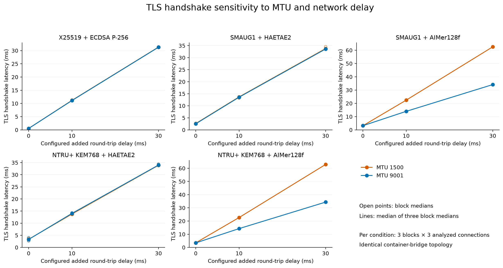
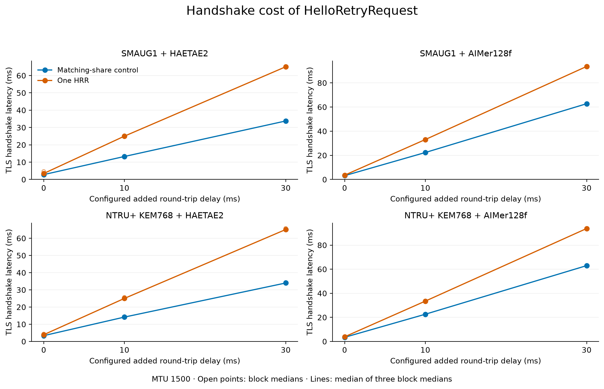
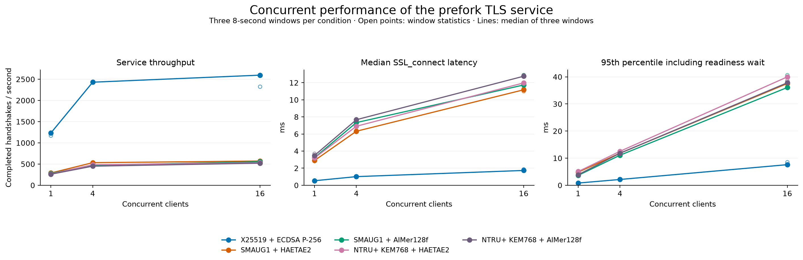
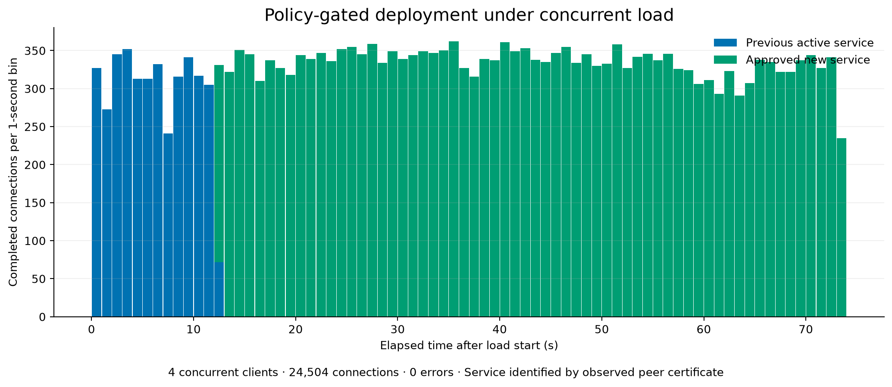

# KPQC TLS: network sensitivity and concurrent deployment

[한국어](README.md) · [Figure gallery](gallery.html) · [Methods](METHODS.en.md)

The existing two-node EC2 lab tested MTU (Maximum Transmission Unit), added network delay, HRR (HelloRetryRequest), concurrent full handshakes, and policy-gated deployment under load. Five representative profiles were tested. Certificate chains and memory were outside this follow-up run.

[Performance execution](https://github.com/17seetwice/kpqc-tls-devops-lab/actions/runs/36016712344) · Source `fa1202c` · 654 performance assertions passed. [Rollout retry](https://github.com/17seetwice/kpqc-tls-devops-lab/actions/runs/36025021206) · Source `c9ebcfa`. **Both instances were independently confirmed stopped through the AWS API.** These results are prepared for review; they have not replaced the repository's existing main result tables.

## 1. MTU and network delay

AWS documents MTU1500 support on all EC2 instance types and a 1500-byte limit for Internet-gateway traffic. Comparing MTU1500 with the prior jumbo-frame environment is therefore relevant. Both new treatments use the same Docker bridge topology. [AWS documentation](https://docs.aws.amazon.com/AWSEC2/latest/UserGuide/network_mtu.html)

Values are medians of three block medians, in ms. Configured added round-trip delay is the sum of the two endpoint egress delays.

| Profile | Added 0 ms · MTU1500 | Added 0 ms · MTU9001 | Added 30 ms · MTU1500 | Added 30 ms · MTU9001 |
|---|---:|---:|---:|---:|
| X25519 + ECDSA P-256 | 0.547 | 0.539 | 31.322 | 31.271 |
| SMAUG1 + HAETAE2 | 2.640 | 2.531 | 33.766 | 33.609 |
| SMAUG1 + AIMer128f | 3.143 | 3.159 | 62.576 | 34.128 |
| NTRU+ KEM768 + HAETAE2 | 3.350 | 3.300 | 33.906 | 33.994 |
| NTRU+ KEM768 + AIMer128f | 3.504 | 3.427 | 62.886 | 34.350 |



[Block-level CSV](network_blocks.csv) includes observed TCP RTT (Round-Trip Time) and MSS (Maximum Segment Size). This is endpoint-egress sensitivity, not measured Internet performance.

## 2. Incremental HRR cost

Each of the 180 induced connections showed exactly one HRR; each of the 180 controls showed zero. Final KEM/signature codes and successful certificate verification were checked. Analysis retains 216 connections after warmup exclusion.

The table shows the median of three within-block differences, `HRR latency − control latency`, in ms.

| Profile | Added RTT 0 ms | Added RTT 10 ms | Added RTT 30 ms |
|---|---:|---:|---:|
| SMAUG1 + HAETAE2 | 0.648 | 11.550 | 31.291 |
| SMAUG1 + AIMer128f | 0.358 | 10.786 | 30.858 |
| NTRU+ KEM768 + HAETAE2 | 0.367 | 10.613 | 30.873 |
| NTRU+ KEM768 + AIMer128f | 0.383 | 10.924 | 30.934 |



## 3. Concurrent throughput

Eight server workers serve 1, 4 or 16 client processes in three eight-second windows per condition. All 273,091 load connections passed TLS negotiation and certificate checks. Values are the median throughput of three windows, in completed handshakes/s.

| Profile | 1 client | 4 clients | 16 clients |
|---|---:|---:|---:|
| X25519 + ECDSA P-256 | 1,232.7 | 2,430.3 | 2,596.2 |
| SMAUG1 + HAETAE2 | 288.9 | 532.8 | 571.5 |
| SMAUG1 + AIMer128f | 279.1 | 471.5 | 556.1 |
| NTRU+ KEM768 + HAETAE2 | 266.0 | 484.0 | 530.7 |
| NTRU+ KEM768 + AIMer128f | 260.5 | 450.0 | 521.3 |



Throughput includes TCP setup, termination and instrumentation overhead and describes the **instrumented service-generator pair**, rather than absolute server capacity. The figure separates SSL_connect latency from connection latency including readiness waiting.

## 4. Deployment under load

In the first full execution, four load processes exited with code 2 after 26,701 recorded connections, without observing the new service certificate. This trial remains classified as failed. Its original process stderr was not exported, so the exact cause is unresolved.

The follow-up removed repeated full-dataset checkpoint writes and added exit-error/resource diagnostics and live-worker checks. **Only the deployment trial was rerun**, maintaining load for another 60 seconds after observing the new certificate. The following results apply to that separate retry.

Four clients completed 24,504 connections over 73.76 seconds. Observed peer certificates identified 3,847 connections to the old service and 20,657 to the approved replacement. There were 0 TLS failures.

- Mixed-KEM candidate: rejected by a classical-only negative probe; active route retained.
- Compliant candidate: promoted after policy and candidate-evidence validation.
- The rejected candidate's certificate never appeared on the active route.



Idle workers of the former service logged accept-timeout exits after promotion. This trial validates forward promotion, not continued availability of the former workers or immediate rollback. It is one bounded transition trial, not a production availability guarantee.

## Evidence and reproduction

Network analysis retains 270 connections and HRR analysis retains 216, excluding their warmup connections. The 720 throughput-priming connections are separate from measured throughput.

- [Methods](METHODS.en.md) · [한국어 방법](METHODS.md)
- [Throughput blocks](throughput_blocks.csv) · [HRR blocks](hrr_blocks.csv) · [Paired contrasts](paired_contrasts.csv)
- [Audit](audit.json) · [First workflow](workflow.public.json) · [Retry workflow](rollout-workflow.public.json) · [Stopped-state verification](cleanup-verification.json)
- [Performance and initial failure records](measurements.public.json.gz) · [Rollout retry records](rollout.public.json.gz) · [Review log](REVIEW_LOG.md)

From the repository root:

```sh
.venv/bin/python 'after_claude/scripts/analyze_systems.py' 'after_claude/systems/measurements.public.json.gz' --rollout-source 'after_claude/systems/rollout.public.json.gz'
.venv/bin/python 'after_claude/scripts/report_systems.py'
```

The three blocks belong to one execution on the same instance pair. Do not pool these bridge-network measurements with previous host-network results or generalize them to untested parameters or production service capacity.
