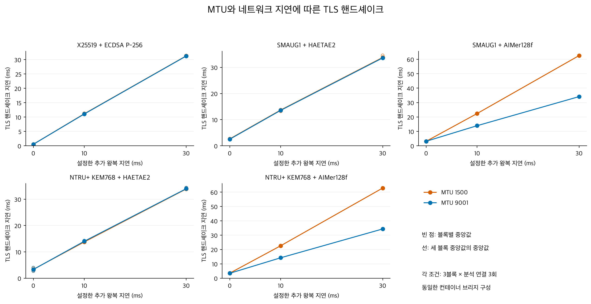
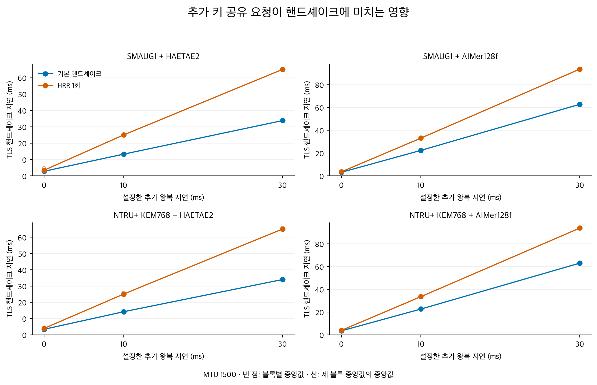
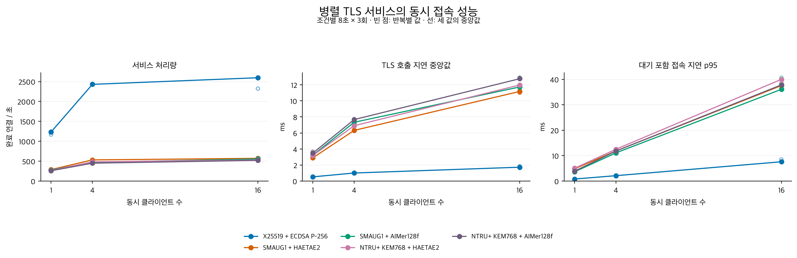
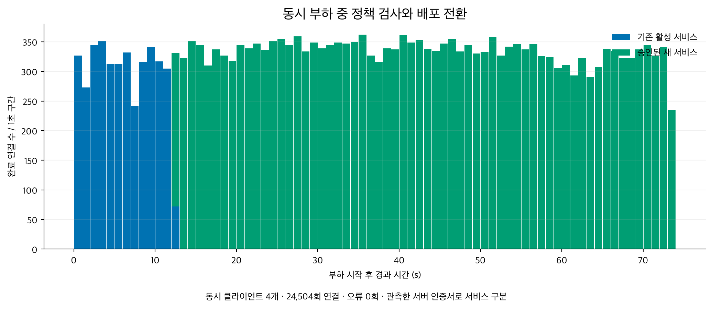

# KPQC TLS: 네트워크 조건과 동시 부하 실험 결과

[English](README.en.md) · [그림 모음](gallery.html) · [실험 방법](METHODS.md)

MTU (Maximum Transmission Unit), 추가 네트워크 지연, HRR (HelloRetryRequest), 동시 접속과 부하 중 배포 전환을 기존 EC2 두 대에서 측정했다. 대표 암호 조합 5개를 사용했으며, 인증서 체인과 추가 메모리 측정은 이번 범위에서 제외했다.

[성능 측정 실행](https://github.com/17seetwice/kpqc-tls-devops-lab/actions/runs/36016712344) · 소스 `fa1202c` · 성능 검증 654항목 통과. [배포 부하 재시험](https://github.com/17seetwice/kpqc-tls-devops-lab/actions/runs/36025021206) · 소스 `c9ebcfa`. 실행 후 **두 EC2의 중지 상태를 AWS API로 별도 확인**했다. 이번 결과는 사용자 검토용이며 저장소 루트의 기존 성능표를 대체하지 않았다.

## 1. MTU 및 네트워크 지연

AWS는 모든 EC2 인스턴스의 MTU1500 지원과 인터넷 게이트웨이 트래픽의 1500바이트 제한을 명시한다. 기존 MTU9001 환경에 MTU1500 대조군을 두는 것은 타당하다. 두 조건은 같은 Docker 브리지 구성에서 비교했다. [AWS 공식 문서](https://docs.aws.amazon.com/AWSEC2/latest/UserGuide/network_mtu.html)

표는 세 블록 중앙값의 중앙값이며 단위는 ms다. 추가 왕복 지연은 양 끝 송신 지연의 합으로 설정한 값이다.

| 암호 조합 | 추가 0 ms · MTU1500 | 추가 0 ms · MTU9001 | 추가 30 ms · MTU1500 | 추가 30 ms · MTU9001 |
|---|---:|---:|---:|---:|
| X25519 + ECDSA P-256 | 0.547 | 0.539 | 31.322 | 31.271 |
| SMAUG1 + HAETAE2 | 2.640 | 2.531 | 33.766 | 33.609 |
| SMAUG1 + AIMer128f | 3.143 | 3.159 | 62.576 | 34.128 |
| NTRU+ KEM768 + HAETAE2 | 3.350 | 3.300 | 33.906 | 33.994 |
| NTRU+ KEM768 + AIMer128f | 3.504 | 3.427 | 62.886 | 34.350 |



각 조건의 관측 TCP RTT (Round-Trip Time)와 MSS (Maximum Segment Size)는 [블록별 CSV](network_blocks.csv)에 함께 제공한다. 송신 측 지연 주입 결과이며 실제 인터넷 경로의 성능을 나타내지는 않는다.

## 2. HRR 추가 비용

HRR 유발 연결 180회에서 각각 HRR 1회, 대조 연결 180회에서 HRR 0회를 확인했다. 두 조건의 최종 KEM·서명 조합과 인증서 검증 성공을 확인했다. 분석에는 준비 연결을 제외한 총 216회를 사용했다.

표는 같은 블록에서 계산한 `HRR 지연 − 대조군 지연`의 세 블록 중앙값이다. 단위는 ms다.

| 암호 조합 | 추가 왕복 지연 0 ms | 추가 왕복 지연 10 ms | 추가 왕복 지연 30 ms |
|---|---:|---:|---:|
| SMAUG1 + HAETAE2 | 0.648 | 11.550 | 31.291 |
| SMAUG1 + AIMer128f | 0.358 | 10.786 | 30.858 |
| NTRU+ KEM768 + HAETAE2 | 0.367 | 10.613 | 30.873 |
| NTRU+ KEM768 + AIMer128f | 0.383 | 10.924 | 30.934 |



## 3. 동시 접속 및 처리량

서버 작업자 8개, 클라이언트 프로세스 1·4·16개 조건에서 각각 8초 × 3회 측정했다. 총 273,091회 연결의 TLS 협상 및 인증서 검증을 확인했다. 표는 세 측정 구간의 처리량 중앙값이며 단위는 완료 핸드셰이크/초다.

| 암호 조합 | 동시 1개 | 동시 4개 | 동시 16개 |
|---|---:|---:|---:|
| X25519 + ECDSA P-256 | 1,232.7 | 2,430.3 | 2,596.2 |
| SMAUG1 + HAETAE2 | 288.9 | 532.8 | 571.5 |
| SMAUG1 + AIMer128f | 279.1 | 471.5 | 556.1 |
| NTRU+ KEM768 + HAETAE2 | 266.0 | 484.0 | 530.7 |
| NTRU+ KEM768 + AIMer128f | 260.5 | 450.0 | 521.3 |



처리량은 TCP 연결·종료·계측 기록 비용을 포함하는 **계측용 서비스와 부하 생성기의 결과**다. 서버의 절대 최대 용량으로 해석하지 않는다. 그래프는 SSL_connect 지연과 준비 대기를 포함한 접속 지연을 구분한다.

## 4. 부하 중 배포 전환

첫 전체 실행에서는 26,701개 접속 기록 후 부하 프로세스 4개가 종료 코드 2로 끝났고, 새 서비스 인증서를 확인하지 못했다. 이 시험은 실패로 보존했다. 해당 버전은 종료 오류 원문을 저장하지 않아 정확한 원인은 확정할 수 없다.

후속 실행에서는 누적 전체 결과를 매번 다시 쓰던 제어 코드를 개선하고, 클라이언트 종료 오류·자원 진단·작업자 생존 여부를 기록했다. **배포 항목만 별도로 재시험**했으며, 새 인증서 관측 후 60초 동안 부하를 추가 유지했다. 아래 결과는 이 재시험에 한정된다.

동시 클라이언트 4개가 73.76초 동안 24,504회 접속했다. 기존 서비스 인증서 3,847회, 승인된 새 서비스 인증서 20,657회를 관측했으며 TLS 실패는 0회였다.

- 고전 KEM도 허용하는 혼합 후보: 부정 프로브에 의해 거절, 기존 활성 경로 유지.
- 승인된 정상 후보: 정책과 후보 증적 확인 후 활성 경로로 전환.
- 활성 경로에서는 거절된 후보의 인증서가 관측되지 않음.



전환 후 유휴 상태가 된 이전 서비스 작업자에서 `accept` 시간 초과 종료가 기록됐다. 이번 시험은 새 서비스로의 전환을 검증하며, 이전 작업자의 지속 가용성이나 즉시 롤백을 검증하지 않는다. 한 번의 제한된 부하 전환 결과이며 운영 환경의 무중단 보장을 의미하지 않는다.

## 자료와 재현

네트워크 지연 분석 270회, HRR 분석 216회는 각각 준비 연결을 제외한 값이다. 처리량 시험 준비 연결 720회는 처리량 계산에서 제외했다. 각 실험의 원기록을 구분해 보존했다.

- [한국어 실험 방법](METHODS.md) · [English methods](METHODS.en.md)
- [처리량 블록별 CSV](throughput_blocks.csv) · [HRR 블록별 CSV](hrr_blocks.csv) · [블록 내 차이](paired_contrasts.csv)
- [검증 요약](audit.json) · [첫 워크플로 증적](workflow.public.json) · [재시험 증적](rollout-workflow.public.json) · [중지 확인](cleanup-verification.json)
- [성능 및 최초 실패 원기록](measurements.public.json.gz) · [배포 재시험 원기록](rollout.public.json.gz) · [검토 기록](REVIEW_LOG.md)

저장소 루트에서 실행:

```sh
.venv/bin/python 'after_claude/scripts/analyze_systems.py' 'after_claude/systems/measurements.public.json.gz' --rollout-source 'after_claude/systems/rollout.public.json.gz'
.venv/bin/python 'after_claude/scripts/report_systems.py'
```

세 블록은 동일 인스턴스 쌍의 한 실행에 속한다. 기존 호스트 네트워크 결과와 직접 합산하지 않으며, 이번 대표 파라미터 밖의 조합과 실서비스의 처리 용량으로 일반화하지 않는다.
