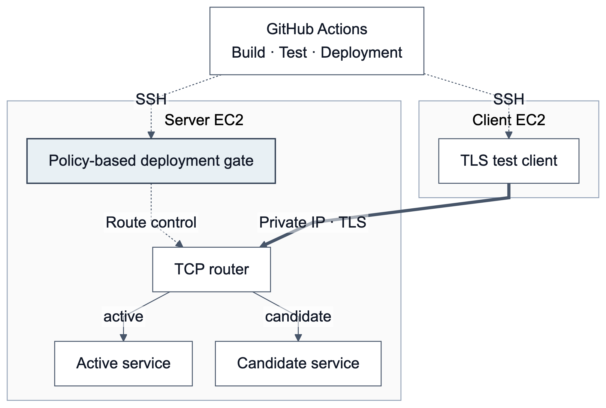

# KPQC TLS 1.3 Measurement and Policy-Based Deployment Validation

For the subsequent experiment, see the [migration, admission and recovery report](../after_claude/release/README.en.md). The content below describes the initial experiment.

Technical report revision · For author review · 2026-09-24

## Abstract

This experiment evaluates TLS (Transport Layer Security) 1.3 handshake costs and deployment-policy compliance using an OpenSSL integration of Korean post-quantum algorithms. Forty-two combinations of seven SMAUG/NTRU+ KEM (Key Encapsulation Mechanism) parameter sets and six HAETAE/AIMer signature parameter sets are compared with a classical baseline. Two EC2 (Elastic Compute Cloud) instances in one availability zone provide client-side SSL_connect latency, endpoint CPU (Central Processing Unit) time, handshake-message byte counts and separately measured peak RSS (Resident Set Size) growth. Deployment tests evaluate promotion of compliant candidates and rejection of configuration or evidence faults. Findings describe this implementation and experimental environment.

## 1. Research questions

- RQ1: What TLS connection-establishment costs are observed across cryptographic configurations and process-reuse conditions?
- RQ2: Can successful probes and restricted-client probes identify candidate policy violations?
- RQ3: Do rejection, promotion and candidate cleanup preserve the intended active routing state?

RQ1 concerns sequential connections. RQ2–3 concern functional deployment behavior; server capacity and production availability are outside the evaluation scope.

## 2. Environment and methods

One server and one client m7i.large instance run in ap-northeast-2a, Seoul, using private IPv4, Docker host networking and MTU (Maximum Transmission Unit) 9001. Each container is limited to two CPUs and 512 MiB. TLS 1.3 and TLS_AES_256_GCM_SHA384 are fixed. Clients explicitly trust the self-signed server leaf and verify its hostname.

KEMs are SMAUG1/3/5 and NTRU+576/768/864/1152; signatures are HAETAE2/3/5 and AIMer128f/192f/256f. X25519 with ECDSA (Elliptic Curve Digital Signature Algorithm) is the baseline. Parameter sets span different security categories and do not form an equal-security ranking.

Each latency mode uses five rounds with randomized configuration order. Fresh-process runs contain three connections per configuration and round. Reused-process runs retain the process and SSL context, exclude two warm-up connections and analyze the following three. Every connection performs a full handshake. Baseline sentinel measurements bracket each round and are excluded from the regular configuration summaries.

| Metric | Definition | Aggregation |
|---|---|---|
| Handshake latency | Monotonic elapsed time around client SSL_connect | Median of 15 connections per configuration and mode |
| CPU time | Difference in user plus system CPU time around the SSL call | Separate client and server records |
| Message bytes | Sent/received handshake-message callback lengths | Directional records |
| Peak RSS growth | Increase in reset process RSS high-water mark during the SSL call | Median of three separate fresh-process runs |

TCP (Transmission Control Protocol) setup, HTTP (Hypertext Transfer Protocol), file transfer and teardown are excluded from the primary latency metric. Message bytes exclude transport headers and retransmissions. RSS is a process page-residency metric, not total algorithm allocation. A 16 MiB page-touch positive control produced the corresponding increase on both EC2 nodes.

## 3. Deployment policy and architecture

**Figure 1. Candidate validation and active-route promotion.** Clients probe the router's candidate route. Observed evidence and approved policy determine promotion or retention of the existing route. The experimental TCP router does not terminate TLS.

Policy requires approved TLS version, KEM, signature and cipher suite, successful certificate verification and rejection of prohibited clients.  A candidate accepting classical-only probes is rejected even when its PQC (Post-Quantum Cryptography) probes succeed. A separate positive control verifies TLS 1.2 probe capability.

Candidate generation, certificate, image and policy identifiers, together with evidence timestamps, detect mismatches and stale observations. Timeouts and malformed output also cause rejection. Binding assumes a trusted controller; it is not remote attestation against a malicious controller.

## 4. Results

| Measurement | Classical baseline | Range of PQC configuration medians |
|---|---:|---:|
| Fresh-process latency | 1.388 ms | 3.503–11.287 ms |
| Reused-process latency | 0.538 ms | 2.403–10.529 ms |
| Client peak RSS growth | 460 KiB | 648–980 KiB |
| Server peak RSS growth | 420 KiB | 628–1,252 KiB |

The 1,935 collected connections comprise 1,290 latency-analysis connections, 129 memory-analysis connections and 516 warm-up/sentinel connections. No session resumption or HRR (HelloRetryRequest) was observed. See the [figure captions](../after_claude/captions.en.md) and [summary CSV](../after_claude/data/summary.csv).

The final AWS (Amazon Web Services) gate passed 63/63 assertions. Active-route monitoring recorded 69 samples with zero failures. Assertions include expected rejections and are not a count of successful TLS connections.

## 5. Provenance and validity

Performance run `aws-extended-20260924T113201Z` and final gate run `aws-gate-20260924T114045Z` were controlled locally and executed on AWS. Their distinct image identities are retained. They are separate from the earlier 32-assertion GitHub Actions run. Public evidence preserves source-result hashes and image identification. The original execution used uncommitted source; later documentation commits do not retroactively identify that source revision.

Results concern one instance pair, sequential connections, directly trusted leaf certificates and custom cryptographic identifiers. Cold-then-warm execution order confounds mode with time. Memory measurements are exploratory, with three observations per configuration. No claims of cryptographic certification, external interoperability, production capacity or uninterrupted service are made.

## 6. Future work

First randomize mode order and assess reproducibility across executions. Subsequent experiments can evaluate network delay/MTU, concurrency, deployment under load and certificate chains. The current sequential server requires a concurrent implementation before a load study. Planned work is tracked separately from completed observations.

Additional interpretation and pending RSS noise-floor validation are documented in [measurement notes (Korean)](MEASUREMENT_NOTES.md). RSS counter accuracy and instrumentation effects remain unquantified; the memory results are exploratory.
