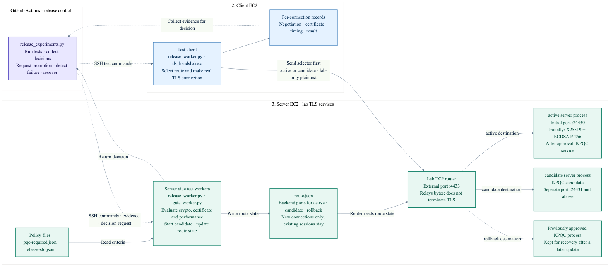
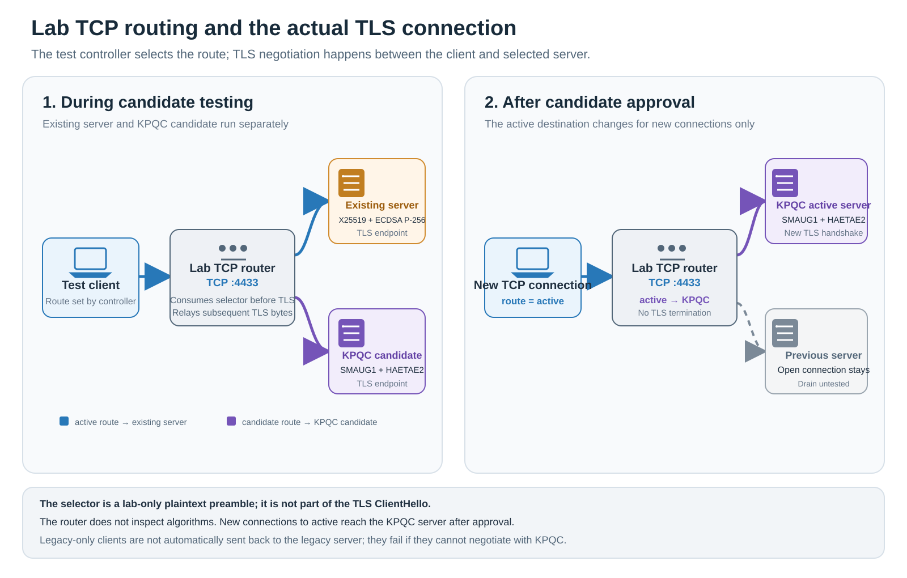
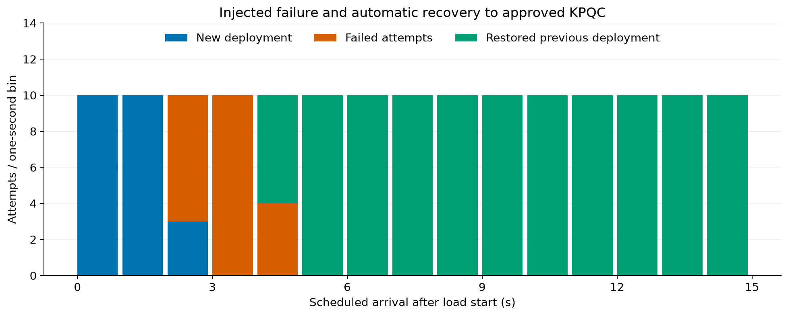

# KPQC migration, deployment admission and recovery

[한국어](README.html) · [Gallery](gallery.html) · [Raw records](measurements.public.json) · [Audit](audit.json)

This Seoul Region trial moved a service from classical cryptography to KPQC, admitted a later update, and restored the previously approved KPQC service after the new service failed. The [GitHub Actions run](https://github.com/17seetwice/kpqc-tls-devops-lab/actions/runs/36032662708) passed 24 checks. After the run, both EC2 instances were stopped and the temporary SSH ingress rule was removed.

## Deployment experiment overview

This trial checks a simple release pattern: **start a new KPQC server separately, test it, and direct new connections to it only after it passes**. If a candidate fails before release, the current service stays active. If an already-approved update fails after release, new connections return to the previously approved KPQC service.

```text
Test controller (release_experiments.py)
        │ starts candidates · evaluates evidence · requests promotion/recovery
        ├──────────────> route.json (routing state read by the router)
        │
Test client ── pre-TLS route selector ──> Lab TCP router :4433
                                           ├── active ─────> current service
                                           └── candidate ─> service under test
```

`active` and `candidate` are route names, not cryptographic algorithms. The test client chooses which route selector to send for each connection. The router reads the selector and `route.json`, connects to the selected backend, and relays the TLS bytes. **TLS does not automatically direct a client to a KPQC or classical server.** The selector and router are lab controls created to run this experiment.

| Term | Meaning in this trial |
|---|---|
| Test client | The project's test program that sends a route selector, makes TLS connections and records results; it is not a browser or a production service client |
| `active` | The service receiving new connections that use the `active` selector |
| `candidate` | A service tested on a separate route before approval |
| Promotion | Make an approved candidate the destination for future `active` connections |
| Recovery (rollback) | After a deployed service fails, verify the earlier approved KPQC service and direct future connections back to it |

Before the first promotion, the classical service is `active` and the KPQC candidate is `candidate`. A rejected candidate leaves the existing `active` target unchanged. Promotion changes the destination for new connections; it does not move TLS connections that are already established. The later update is also approved before failure is injected, so **pre-deployment rejection** and **post-deployment recovery** are separate scenarios.

The fixed-arrival test, `10 attempts/s × 10 seconds × 3 windows`, schedules 300 new connection attempts per candidate from one test client. Each window schedules 100 attempts and must pass on its own. This does not mean 300 EC2 instances or 300 client computers. The three windows are separate load windows, not one continuous 30-second test.

## Test environment



| Item | Setup |
|---|---|
| AWS location | Seoul Region, same Availability Zone |
| Compute | Two `m7i.large` EC2 instances: one TLS server and one test client |
| Container limits | 2 CPUs and 512 MiB memory per container |
| Container network | Docker bridge; MTU (Maximum Transmission Unit, maximum network-packet size) 1500 bytes |
| TLS | TLS (Transport Layer Security) 1.3, full handshake on every attempt |
| Certificate | The client directly trusts the test server certificate and checks its name |
| Client | Prepared test client that can switch cryptographic settings |

| Service state | Key exchange + certificate signature |
|---|---|
| Existing service | X25519 + ECDSA P-256 |
| KPQC service | SMAUG1 + HAETAE2 |

## Admission criteria and timing metrics

The SLO (Service Level Objective) is a service-response target set before the trial. Each candidate is tested with the same load and criteria.

| Criterion | Pass condition |
|---|---|
| Load | 10 scheduled attempts/s, three 10-second windows (300 scheduled attempts per candidate) |
| Failure rate | At most 1% in each window |
| Timely success | At least 99% of scheduled attempts complete successfully within 200 ms in each window |
| Successful completion p95 | At most 200 ms in each window |
| Load-generator lateness p95 | At most 50 ms; exceeding it blocks admission |
| Evidence | Missing or candidate-mismatched evidence blocks admission |

Two different durations are recorded:

| Metric | Start and end | Included work |
|---|---|---|
| Connection completion latency (used for deployment SLO) | Scheduled arrival time to C-client process exit | Scheduling delay, process startup and initialization, TCP connection, readiness signal, TLS handshake and shutdown |
| TLS handshake latency (reported separately) | Immediately before `SSL_connect` to its return | The TLS handshake call interval |

The first metric checks whether the candidate meets the test service's response target. The second measures only the TLS call interval. Neither includes an HTTP request or real application work.

## Candidate roles and sequence

| Stage | Meaning | What changes in this trial |
|---|---|---|
| Initial KPQC deployment candidate | First candidate to replace the existing X25519 + ECDSA P-256 service with KPQC | Cryptographic configuration and server certificate |
| Subsequent update candidate | Represents a service update after KPQC adoption | Server certificate and server process; SMAUG1 + HAETAE2 remains unchanged |
| Previously approved service | The approved KPQC service used as the recovery target after the subsequent update fails | Route traffic back to this service instead of the failed candidate |

The trial proceeds as follows. Each step is linked to the code that implements it.



1. Keep the existing X25519 + ECDSA P-256 service running on the `active` route. Start the SMAUG1 + HAETAE2 candidate as a separate server process on a separate port. It does not replace the active service yet. Implementation: [`gate_worker.py`](../../../scripts/gate_worker.py#L162-L175).

   ```python
   port = state.get("next_port", 24431)
   state["next_port"] = port + 1
   procs["candidate"] = launch(name, group, sig, port)
   ```

   The test client connects to the server's TCP router on port `4433` and sends the `candidate` route selector. The router reads that selector, connects to the candidate's separate port, then relays the TLS traffic that follows. The selector is lab routing data, not a TLS message. The TLS handshake then checks the candidate's cryptographic and certificate policy. Implementation: [`tls_handshake.c`](../../../scripts/tls_handshake.c#L164-L169), [`gate_worker.py`](../../../scripts/gate_worker.py#L54-L74).

2. Run a fixed-arrival-rate test through the same `candidate` route. Send 10 connection attempts per second for 10 seconds, and repeat this window three times. That is 10 × 10 = 100 scheduled attempts per window, or 300 per candidate in total. These are attempts generated by the single test-client instance, not 300 client computers. The 10-second duration creates 100 attempts per window at this configured rate.

   Ten attempts per second schedules a new connection about every 100 ms. The generator does not wait for the previous connection to finish before scheduling the next one.

   Three windows are part of the experiment's pre-set policy. Each is evaluated separately, and all three must pass. They are not assumed to be statistically independent samples. The rate, duration and number of windows are lab test conditions, not an industry standard. Final admission requires both the cryptographic/certificate checks and all three performance windows to pass. Implementation: [`release-slo.json`](../../../policies/release-slo.json), [`release_worker.py`](../../../scripts/release_worker.py#L37-L47), [`release_experiments.py`](../../../scripts/release_experiments.py#L41-L51).

3. If the TLS evidence and all three performance windows meet policy, switch the candidate to the active route. The promotion action checks the policy again immediately before changing the active-service pointer. Existing connections are not forcibly moved. Implementation: [`gate_worker.py`](../../../scripts/gate_worker.py#L196-L208).

   ```python
   decision = main({"action": "decision", **q["evidence"]})
   if not decision["deployment_allowed"]:
       raise ValueError("gate did not approve")
   state["active"] = state["candidate"]
   state["candidate"] = None
   ```

4. Start the subsequent update candidate, with a new certificate and separate server process, on another port. Run the same TLS probes and three load windows. The active KPQC service stays available as the recovery target. Implementation: [`release_experiments.py`](../../../scripts/release_experiments.py#L41-L63), [`gate_worker.py`](../../../scripts/gate_worker.py#L162-L175).

   ```python
   binding = worker("server", {"action": "candidate", "name": name})["route"]["candidate"]
   # Collect TLS and performance evidence for this candidate, then:
   promotion = worker("server", {"action": "promote", **q})
   ```

5. Inject a failure into the updated service. After consecutive failures are detected, make a fresh TLS connection to the previously approved service and check its certificate and cryptographic policy before restoring its route. Implementation: [`release_experiments.py`](../../../scripts/release_experiments.py#L75-L87), [`release_worker.py`](../../../scripts/release_worker.py#L96-L108).

   ```python
   t0 = time.monotonic_ns(); D["fault"] = worker("server", {"action": "fault-active"})
   target = health("rollback")
   D["rollback"] = worker("server", {"action": "rollback", "health": target,
                                      "health_observed_at_ns": time.time_ns()})
   ```

Both KPQC candidates use SMAUG1 + HAETAE2. This is not an algorithm-update comparison; it models initial KPQC adoption and a later KPQC service update and recovery. Recovery does not return to classical cryptography.

## Candidate admission results

All candidates passed the cryptographic checks. To verify that the performance gate rejects a slow candidate, a 350 ms delay was injected before TLS processing. This is an intentional performance-regression condition, not the intrinsic processing time of the KPQC algorithms.

The values below are successful connection-completion p95 values for each 10-second window. Each window scheduled 100 attempts.

| Candidate | Crypto check | Performance decision | Completion p95 by window (ms) |
|---|---|---|---|
| Injected-delay candidate | Pass | Reject | 382.56 · 382.46 · 381.96 |
| Initial KPQC deployment candidate | Pass | Admit | 32.99 · 33.19 · 33.28 |
| Subsequent update candidate | Pass | Admit | 33.20 · 32.56 · 32.74 |


The delayed candidate passed cryptographic checks but exceeded the response target, so it was rejected. After the initial KPQC candidate was admitted, the active route's server certificate and negotiated values were checked. The subsequent update passed the same checks. Performance evidence is bound to the candidate, certificate and policy identifiers and checked again at activation.

## Failure recovery results

The server-process group deployed by the subsequent update was stopped. After two consecutive failed health observations, the controller checked the previously approved KPQC service's connectivity, certificate, policy and approval record, then restored its route. A classical service, a different certificate or stale recovery evidence was not accepted as a recovery target.

| Observation | Result |
|---|---:|
| Failure-injection request to detection | 1.596 s |
| Failure-injection request to first successful connection after recovery | 2.951 s (pre-set target: within 10 s) |
| Scheduled attempts during failure observation | 150 |
| Failed attempts | 21 |
| Successful connections to the new deployment | 23 |
| Successful connections to the restored previous service | 106 |
| Final attempts | All 20 connected successfully to the previously approved service |



Recovery time uses the controller's monotonic clock and includes SSH control round trips. The 21 failures during the incident remain in the results. This does not demonstrate zero downtime. Continuity of existing TCP sessions or application workflows was not tested.

## Implementation checks and scope

- A server-worker exit after an idle `accept` timeout was fixed. Eight workers and a successful connection were confirmed after 17 seconds idle.
- The previously approved service remained available as a recovery target while the next candidate was tested.
- A Mac amd64-emulation preflight that rejected a healthy candidate when 2 of 100 attempts exceeded 200 ms is preserved separately. The target was not changed; native Linux preflight and AWS execution were kept separate.
- These results describe one bounded AWS trial. They do not establish maximum throughput, production-service SLOs, long-term availability or automatic source-code transformation.

[Workflow record](workflow.public.json) · [Cleanup verification](cleanup-verification.json) · [Experiment plan](../../../docs/RELEASE_EXPERIMENT_PLAN.md)
