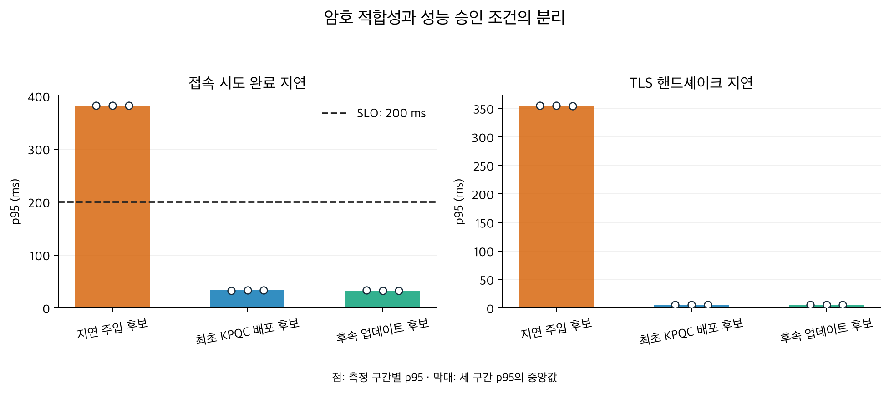
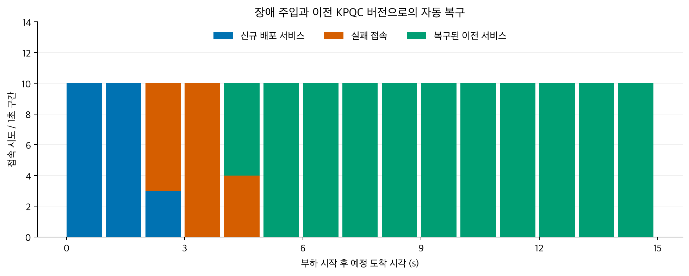

# KPQC 전환·배포 승인·장애 복구

[English](README.en.html) · [그림 모음](gallery.html) · [원자료](measurements.public.json) · [검증 요약](audit.json)

서울 리전의 시험 환경에서 기존 고전 암호 서비스에서 KPQC 서비스로 전환하고, 후속 업데이트를 승인한 뒤 새 서비스 장애 시 이전에 승인한 KPQC 서비스로 복구하는 절차를 시험했다. GitHub Actions 실행은 [여기](https://github.com/17seetwice/kpqc-tls-devops-lab/actions/runs/36032662708)에서 확인할 수 있다. 24개 검증 항목이 통과했고, 실행 후 두 EC2 인스턴스가 중지되고 임시 SSH 인바운드 규칙이 제거됐다.

## 시험 환경

| 항목 | 설정 |
|---|---|
| AWS 위치 | 서울 리전, 동일 가용 영역 |
| 컴퓨터 | EC2 `m7i.large` 2대: TLS 서버 1대, 시험 클라이언트 1대 |
| 컨테이너 제한 | 각 컨테이너 CPU 2개, 메모리 512 MiB |
| 컨테이너 네트워크 | Docker 브리지, MTU (Maximum Transmission Unit, 한 네트워크 패킷의 최대 크기) 1500바이트 |
| TLS | TLS (Transport Layer Security) 1.3, 매 시도 전체 핸드셰이크 |
| 인증서 | 시험용 서버 인증서를 클라이언트가 직접 신뢰하고 이름을 확인 |
| 클라이언트 | 암호 설정을 전환할 수 있도록 미리 준비한 시험 클라이언트 |

| 배포 상태 | 키 교환 + 인증 서명 |
|---|---|
| 기존 서비스 | X25519 + ECDSA P-256 |
| KPQC 서비스 | SMAUG1 + HAETAE2 |

## 승인 기준과 시간 지표

SLO (Service Level Objective)는 시험 전에 정한 서비스 응답 목표다. 각 후보에 같은 부하와 기준을 적용했다.

| 기준 | 통과 조건 |
|---|---|
| 부하 | 초당 10회, 10초 구간 3회 (후보당 총 300회 예정) |
| 실패율 | 각 10초 구간에서 1% 이하 |
| 빠른 성공 비율 | 각 구간에서 예정 접속의 99% 이상이 200 ms 이내 성공 |
| 성공 지연 p95 | 각 구간에서 200 ms 이하 |
| 부하 생성 지연 p95 | 50 ms 이하. 초과하면 승인하지 않음 |
| 증적 | 필수 기록이 없거나 후보와 일치하지 않으면 승인하지 않음 |

보고서에는 서로 다른 두 시간을 기록한다.

| 지표 | 시작과 끝 | 포함되는 작업 |
|---|---|---|
| 접속 완료 지연 (배포 SLO 판정용) | 예정 접속 시각부터 C 클라이언트 프로세스 종료까지 | 스케줄 대기, 프로세스 시작·초기화, TCP 연결, 준비 신호, TLS 핸드셰이크, 종료 |
| TLS 핸드셰이크 지연 (별도 관측값) | `SSL_connect` 호출 직전부터 반환까지 | TLS 핸드셰이크 호출 구간 |

첫 번째 지표는 후보가 시험 서비스 응답 목표를 만족하는지 판단한다. 두 번째는 TLS 호출 구간만 관측한다. 둘 다 HTTP 요청이나 금융 업무 거래 시간은 포함하지 않는다.

## 배포 후보와 순서

| 단계 | 의미 | 이 시험에서 바뀐 것 |
|---|---|---|
| 최초 KPQC 배포 후보 | 기존 X25519 + ECDSA P-256 서비스를 KPQC 서비스로 처음 교체하는 후보 | 암호 조합과 서버 인증서 |
| 후속 업데이트 후보 | KPQC 도입 이후의 서비스 갱신을 나타내는 후보 | 서버 인증서와 서버 프로세스. 암호 조합은 SMAUG1 + HAETAE2로 유지 |
| 이전 승인 서비스 | 후속 업데이트 장애 때 복구 대상으로 쓰는, 먼저 승인된 KPQC 서비스 | 복구 시 새 후보 대신 이 서비스로 접속 경로를 돌림 |

실험 흐름은 다음과 같다.

1. 고전 암호 서비스가 동작하는 상태에서 최초 KPQC 배포 후보를 검사한다.
2. 암호·인증서·성능 기준을 모두 만족하면 KPQC 후보를 활성 경로로 전환한다.
3. 새 인증서와 별도 서버 프로세스를 가진 후속 업데이트 후보를 검사하고 승인한다.
4. 후속 업데이트 서비스에 장애를 주입한다. 이전 승인 서비스의 현재 TLS 접속, 인증서, 암호 정책을 다시 확인한 뒤 그 서비스로 경로를 복구한다.

최초 후보와 후속 후보는 모두 SMAUG1 + HAETAE2를 사용한다. 이 시험은 알고리즘 업데이트 비교가 아니라 최초 KPQC 도입과 KPQC 서비스 갱신·복구 절차를 각각 모사한다. 복구 후에도 고전 암호 서비스로 돌아가지 않는다.

## 후보 승인 결과

모든 후보가 암호 검사를 통과했다. 성능 게이트가 느린 후보를 거절하는지 확인하기 위해 지연 주입 후보의 TLS 처리 전에 350 ms 대기를 넣었다. 이는 의도적으로 만든 성능 회귀 조건이며 KPQC 암호 자체의 처리 시간은 아니다.

아래 수치는 각 10초 구간에서 성공한 접속의 완료 지연 p95다. 한 구간에는 100회 접속을 예정했다.

| 후보 | 암호 검사 | 성능 판정 | 구간별 접속 완료 지연 p95 (ms) |
|---|---|---|---|
| 지연 주입 후보 | 통과 | 거절 | 382.56 · 382.46 · 381.96 |
| 최초 KPQC 배포 후보 | 통과 | 승인 | 32.99 · 33.19 · 33.28 |
| 후속 업데이트 후보 | 통과 | 승인 | 33.20 · 32.56 · 32.74 |

지연 주입 후보는 암호 검사에는 통과했지만 응답 목표를 넘어서 거절됐다. 최초 KPQC 후보가 승인된 뒤 활성 경로의 서버 인증서와 실제 협상 결과를 확인했고, 후속 업데이트 후보도 같은 검사를 거쳐 승인됐다. 성능 증적은 후보·인증서·정책 식별자에 연결하고 활성화 시 다시 확인한다.

## 장애 복구 결과

후속 업데이트로 배포한 서버 프로세스 그룹을 중단했다. 상태 확인이 연속 두 번 실패하자, 제어기는 이전 승인 KPQC 서비스의 접속 상태와 인증서·정책·승인 기록을 검사한 뒤 연결 경로를 복구했다. 고전 암호 서비스, 다른 인증서 또는 오래된 복구 기록은 복구 대상으로 인정하지 않았다.

| 관측 항목 | 결과 |
|---|---:|
| 장애 주입 요청부터 장애 감지까지 | 1.596초 |
| 장애 주입 요청부터 복구 후 첫 연결 성공까지 | 2.951초 (사전 목표 10초 이내) |
| 장애 관측 중 예정 접속 | 150회 |
| 실패 | 21회 |
| 신규 배포 서비스 연결 성공 | 23회 |
| 이전 승인 서비스 복구 후 연결 성공 | 106회 |
| 마지막 접속 | 20회 모두 이전 승인 서비스로 성공 |

복구 시간은 제어기의 단조 시계로 측정했고 SSH 제어 왕복도 포함한다. 장애 중 실패 21회를 결과에 포함했다. 따라서 이 시험은 무중단을 입증하지 않는다. 기존 TCP 연결이나 금융 거래가 유지되는지도 시험하지 않았다.

## 구현 점검과 적용 범위

- 유휴 `accept` 시간 초과 뒤 서버 작업자가 종료되던 문제를 수정했다. 17초 유휴 후 작업자 8개와 정상 연결을 확인했다.
- 다음 후보 시험 중에도 이전 승인 서비스가 복구 대상으로 유지되는 것을 확인했다.
- Mac amd64 에뮬레이션 사전시험에서 정상 후보 100회 중 2회가 200 ms를 초과해 거절된 기록을 별도로 보존했다. 기준을 바꾸지 않고 네이티브 Linux 사전시험과 AWS 실행을 분리했다.
- 이 결과는 한 번의 제한된 AWS 시험에 해당한다. 최대 처리량, 금융 업무 SLO, 장기간 가용성, 자동 소스 코드 변환을 검증한 결과는 아니다.

[워크플로 기록](workflow.public.json) · [자원 정리 확인](cleanup-verification.json) · [실험 계획](../../../docs/RELEASE_EXPERIMENT_PLAN.md)
