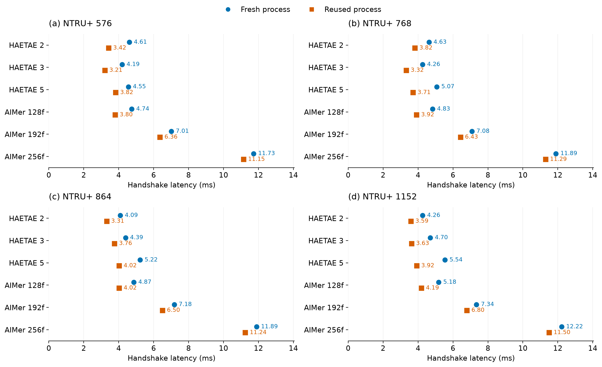

# TLS handshake performance: process initialization and configuration reuse

[한국어](README.md) | English

Run: `aws-extended-20260924T134811Z` · Source: `cfd6bcc` · [GitHub Actions evidence](https://github.com/17seetwice/kpqc-tls-devops-lab/actions/runs/36007402798)

## Scope

This is a standalone TLS handshake performance experiment. It does not test deployment admission, CI/CD or failure recovery.

## What is being compared?

The experiment compares TLS handshake latency for the same cryptographic configuration when the test program starts afresh for each connection versus when a running process creates another connection.

### What does process reuse mean in this experiment?

Process reuse means using the running TLS test program and its prepared TLS configuration for another connection.

- Fresh-process mode (cold): start a new client for each connection; the server also prepares TLS configuration in a new child process.
- Reused-process mode (warm): retain the running program and its TLS configuration across connections. For one cryptographic configuration, perform two preparation connections and analyze the next three.

Both modes create a new connection and perform a full TLS handshake, including authentication and key exchange. TLS session resumption, which uses previous connection state to shorten the procedure, is disabled. The experiment compares handshake latency with and without reusing the program and configuration.

Reuse applies within repeated connections for one configuration. Fresh-process mode does not forcibly clear operating-system caches.

### How is this implemented in code?

The measurement script passes the mode and connection count to the server and client workers. `warm` is false for cold mode and true for warm mode. See [scripts/extended_handshake.py](../../scripts/extended_handshake.py#L62-L68).

```python
count = 5 if mode == 'warm' else 3
q = {'kem': k, 'signature': s, 'count': count, 'warm': mode == 'warm'}
worker('server', {'action': 'start', **q})
cs = worker('client', {'action': 'clients', **q, 'ip': IP})['rows']
```

In warm mode, the client worker starts the C test program once to handle five connections. In cold mode, it starts the program once per connection inside a loop. See [scripts/handshake_worker.py](../../scripts/handshake_worker.py#L45-L64).

```python
if q.get('warm'):
    env['KPQC_WARM'] = '1'
    p = subprocess.run([BIN, 'client', q.get('client_kem', k), sigalg(s), str(STATE/f'{s}.crt'), '-', q['ip'], '4433', str(prefix), str(q['count']), q.get('host', 'kpqc-lab.internal')], capture_output=True, timeout=120, env=env)
else:
    for i in range(q['count']):
        p = subprocess.run([BIN, 'client', q.get('client_kem', k), sigalg(q.get('client_signature', s)), str(STATE/f'{q.get("trust_signature", s)}.crt'), '-', q['ip'], '4433', str(path), '1', q.get('host', 'kpqc-lab.internal')], capture_output=True, timeout=25, env=env)
```

In C `handshake()`, `KPQC_WARM` selects either the saved OpenSSL `SSL_CTX` configuration or a newly created context. Both paths create a new per-connection `SSL` object. See [scripts/tls_handshake.c](../../scripts/tls_handshake.c#L148-L155).

```c
if (getenv("KPQC_WARM")) {
    if (!warm_context)
        warm_context = context(server, group, sig, cert, key);
    c = warm_context;
} else {
    c = context(server, group, sig, cert, key);
}
SSL *s = SSL_new(c);  // new TLS connection object for each connection
```

In cold mode, the server handles each accepted connection in a child process. In warm mode, the server process handles repeated connections. See [scripts/tls_handshake.c](../../scripts/tls_handshake.c#L298-L307).

```c
if(getenv("KPQC_WARM")){
    failed+=handshake(conn,1,argv[2],argv[3],argv[4],argv[5],argv[10],name)!=0;
    continue;
}
pid_t p=fork();
if(!p){
    close(fd);
    int rc=handshake(conn,1,argv[2],argv[3],argv[4],argv[5],argv[10],name);
    _exit(rc);
}
close(conn);
waitpid(p,&status,0);
```

Warm mode makes five connections: the first two are marked as preparation runs and the next three are analyzed. This is recorded by `count` and `warmup` in [scripts/extended_handshake.py](../../scripts/extended_handshake.py#L62-L76). Here, keeping the process running means retaining the server/client test programs during these repeated measurements; it does not mean restarting or retaining EC2 instances or containers per connection.

### Why change the measurement order?

If fresh-process trials always run first, reused-process trials are always measured later. CPU load or cache state may change during that interval, mixing execution-time effects with process-reuse effects.

A block pairs one measurement sequence for each mode. Ten blocks were run:

- Five blocks: fresh-process mode → reused-process mode.
- Five blocks: reused-process mode → fresh-process mode.
- The block order was shuffled. Within each block, the 43 configurations were randomized, with the same configuration order used for both modes.

This is balanced execution order: both modes start first equally often. Process reuse is the comparison of interest; balancing is a design choice that reduces systematic first/last ordering bias.

### What does the timer include?

Process creation, explicit TLS configuration, TCP establishment and the experimental readiness signal precede timing. The main metric is elapsed time around the client's `SSL_connect` call, not total program startup time. Initialization first performed inside the call and cache-state effects may still contribute.

## Design and validation

Two existing EC2 (Elastic Compute Cloud) instances performed sequential TLS (Transport Layer Security) connections. No additional instances were created. Ten paired blocks used five cold-first and five warm-first assignments in shuffled order. Configuration order was randomized within a block and shared across its two modes. Each of the 43 configurations has 30 analyzed connections per mode.

All 3,600 collected connections passed the protocol checks; 2,580 enter latency analysis and 1,020 are warm-up or sentinel observations. The audit checked negotiated group/signature identifiers, certificate verification, TLS version and cipher, disabled session resumption, zero HRR (HelloRetryRequest), matching directional message bytes, mode-order balance and paired configuration order. No new memory experiment was performed.

### Which recorded fields are validated?

These are actual JSON field names. Each connection is stored under `rounds[].profiles[].sessions[]`, with separate `client` and `server` records. Profile `kem`/`signature` names describe the intended configuration; `group_code`/`signature_code` are numeric identifiers observed in TLS messages.

| Check | JSON field | Expected value or comparison |
|---|---|---|
| Handshake success | `success` | `true` |
| Key-exchange group | `group_code` | `codes[k]`; e.g. `smaug1` → `65056` (`0xFE20`) |
| Server authentication signature | `signature_code` | `sigs[s]`; e.g. `haetae2` → `65408` (`0xFF80`) |
| Certificate verification | `verify_result` | `0`: no verification error |
| Protocol version | `tls_version` | `"TLSv1.3"` |
| Cipher suite | `cipher` | `"TLS_AES_256_GCM_SHA384"` |
| Session resumption | `reused` | `false` |
| HelloRetryRequest | `hello_retry_requests` | `0` |
| Directional message lengths | `sent_handshake_bytes`, `received_handshake_bytes` | Client sent = server received, and vice versa |

`reused` means TLS session resumption, not process reuse. Process reuse is identified by `rounds[].mode == "warm"`. Certificate verification here means that the client verifies the server. A zero server-side verification result does not establish client authentication; the experiment is server-authenticated only.

The numeric identifiers are mappings used by this experimental image. Full mappings: [scripts/extended_handshake.py:39–40](https://github.com/17seetwice/kpqc-tls-devops-lab/blob/77e0175d812678823b702c4611f68e8d30ec88ef/scripts/extended_handshake.py#L39-L40).

```python
    codes={'X25519':29,'smaug1':65056,'smaug3':65059,'smaug5':65062,'ntruplus_kem576':65064,'ntruplus_kem768':65067,'ntruplus_kem864':65070,'ntruplus_kem1152':65073}
    sigs={'EC':1027,'haetae2':65408,'haetae3':65409,'haetae5':65410,'aimer128f':65411,'aimer192f':65413,'aimer256f':65415}
```

The C callback reads the signature from `CertificateVerify` at [scripts/tls_handshake.c:43–47](https://github.com/17seetwice/kpqc-tls-devops-lab/blob/77e0175d812678823b702c4611f68e8d30ec88ef/scripts/tls_handshake.c#L43-L47) and the group from `ServerHello.key_share` at [scripts/tls_handshake.c:70–76](https://github.com/17seetwice/kpqc-tls-devops-lab/blob/77e0175d812678823b702c4611f68e8d30ec88ef/scripts/tls_handshake.c#L70-L76). JSON output is implemented at [scripts/tls_handshake.c:196–209](https://github.com/17seetwice/kpqc-tls-devops-lab/blob/77e0175d812678823b702c4611f68e8d30ec88ef/scripts/tls_handshake.c#L196-L209).

Collection-time checks: [scripts/extended_handshake.py:70–75](https://github.com/17seetwice/kpqc-tls-devops-lab/blob/77e0175d812678823b702c4611f68e8d30ec88ef/scripts/extended_handshake.py#L70-L75). Here `c` is the client record, `t` the server record, `r` each endpoint in turn, and `k`/`s` the intended KEM/signature names.

```python
            for i,(c,t) in enumerate(zip(cs,ss)):
                for r in [c,t]:
                    assert r['success'] and r['group_code']==codes[k] and r['signature_code']==sigs[s] and not r['reused'] and r['verify_result']==0
                    assert r['tls_version']=='TLSv1.3' and r['cipher']=='TLS_AES_256_GCM_SHA384' and r['hello_retry_requests']==0
                    if mode=='memory':assert r['rss_peak_reset_ok'] and r['rss_window_peak_growth_kib']>=0
                assert c['sent_handshake_bytes']==t['received_handshake_bytes'] and t['sent_handshake_bytes']==c['received_handshake_bytes']
```

The memory branch belongs to the shared collector; it is not executed in this cold/warm-only run. In the first recorded SMAUG1 + HAETAE2 sample, client-sent/server-received lengths are both 876 bytes; server-sent/client-received lengths are both 5014 bytes. These are handshake message bytes, excluding TCP/IP headers and retransmissions.

### How are 5:5 order balance and paired configuration order checked?

Schedule generation: [scripts/extended_handshake.py:44–52](https://github.com/17seetwice/kpqc-tls-devops-lab/blob/77e0175d812678823b702c4611f68e8d30ec88ef/scripts/extended_handshake.py#L44-L52).

```python
    rng=random.Random(D['random_seed'])
    schedule=[]
    if args.balanced:
        first_modes=['cold']*5+['warm']*5
        rng.shuffle(first_modes)
        for block,first in enumerate(first_modes[:1] if args.smoke else first_modes):
            order=list(pairs);rng.shuffle(order)
            for mode in [first,'warm' if first=='cold' else 'cold']:
                schedule.append((mode,block,list(order)))
```

`first_modes` contains five cold-first and five warm-first blocks, shuffled by the seeded generator. `order` is randomized once per block; both modes receive a copy of the same list. Thus, if a block measures configuration A → B → C, both modes use A → B → C. The full experiment uses all 43 configurations and all ten blocks, without `--smoke`.

The saved schedule and collected records are checked again at [experiments/scripts/analyze_balanced.py:5–18](https://github.com/17seetwice/kpqc-tls-devops-lab/blob/77e0175d812678823b702c4611f68e8d30ec88ef/experiments/scripts/analyze_balanced.py#L5-L18).

```python
d=json.loads(source.read_text());assert d['status']=='passed' and d['cleanup_ok']
schedule=d['schedule'];assert len(schedule)==20
assert sum(p['mode']=='cold' for p in schedule[::2])==5
```

```python
for a,b in zip(schedule[::2],schedule[1::2]):
 assert a['block']==b['block'] and a['configuration_order']==b['configuration_order'] and {a['mode'],b['mode']}=={'cold','warm'}
for plan,block in zip(schedule,d['rounds']):
 assert (plan['mode'],plan['block'])==(block['mode'],block['block'])
 profiles=block['profiles']; assert len(profiles)==45 and profiles[0]['sentinel'] and profiles[-1]['sentinel']
 assert [(p['kem'],p['signature']) for p in profiles[1:-1]]==[tuple(p) for p in plan['configuration_order']]
```

- `schedule[::2]` selects the first mode of each block and verifies five cold-first blocks.
- The mode-set check requires one cold and one warm entry per block, implying five warm-first blocks.
- Equal `configuration_order` lists establish paired ordering.
- Comparing `profiles[1:-1]` with the plan checks actual collection order, excluding the two boundary sentinels.

Protocol fields and directional bytes are rechecked at [experiments/scripts/analyze_balanced.py:24–30](https://github.com/17seetwice/kpqc-tls-devops-lab/blob/77e0175d812678823b702c4611f68e8d30ec88ef/experiments/scripts/analyze_balanced.py#L24-L30); sample counts at [experiments/scripts/analyze_balanced.py:31–35](https://github.com/17seetwice/kpqc-tls-devops-lab/blob/77e0175d812678823b702c4611f68e8d30ec88ef/experiments/scripts/analyze_balanced.py#L31-L35). Code links and line numbers are pinned to the documentation-reference commit. The experiment's original source remains `cfd6bcc`, as stated above.

## Results

| Condition | X25519 + ECDSA | Range of PQC configuration medians |
|---|---:|---:|
| Fresh process | 1.724 ms | 3.891–12.218 ms |
| Reused process | 0.815 ms | 2.852–11.500 ms |

ECDSA denotes Elliptic Curve Digital Signature Algorithm and PQC denotes Post-Quantum Cryptography. Latency covers the client SSL_connect call.


Figure 1. Baseline and SMAUG handshake latency. Each point is the median of 30 connections per configuration and mode. Both modes perform full handshakes. Tiny differences between points rounding to the same value should not be interpreted as practical improvements.



Figure 2. NTRU+ handshake latency. Measurement conditions, aggregation and axis limits match Figure 1.

## Interpretation

Pooled within-run medians were lower for the reused-process mode in all 43 configurations, but some differences were very small. Across PQC configurations, the median of ten paired block ratios (warm/cold) ranged from approximately 0.659 to 0.988. When the blocks were split by starting mode, two configurations had a subgroup median ratio of at least one. Reuse is therefore not claimed to be faster in every block or ordering. See `paired.csv` and `blocks.csv`.

The previous run had baseline medians of 1.388 ms (cold) and 0.538 ms (warm), compared with 1.724 and 0.815 ms here. Available evidence does not identify a single cause of this between-run difference. Balanced ordering addresses the original fixed-order design but does not replace replication across dates or independent instance pairs. The two datasets were not pooled.

## Deployment and cleanup

Local and AWS gate runs each passed 63/63 assertions. The AWS active-route monitor recorded 245 samples with zero failures; this does not establish continuous availability. The workflow took 34 minutes 44 seconds, including build, instance startup, transfer, tests and cleanup. This is not TLS handshake time.

Cleanup evidence reports completion with no errors. A separate AWS API (Application Programming Interface) read confirmed that both instances were stopped. EBS (Elastic Block Store) volumes remain provisioned and have separate storage charges.

## Reproduction

```sh
.venv/bin/python 'experiments/scripts/analyze_balanced.py' 'experiments/process-reuse/measurements.public.json' 'experiments/process-reuse'
```

`measurements.public.json` contains the public workflow measurements; `workflow.public.json` contains gate and cleanup evidence. `summary.csv`, `blocks.csv` and `paired.csv` hold configuration medians, block medians and paired-mode ratios. `audit.json` records the validation summary.
